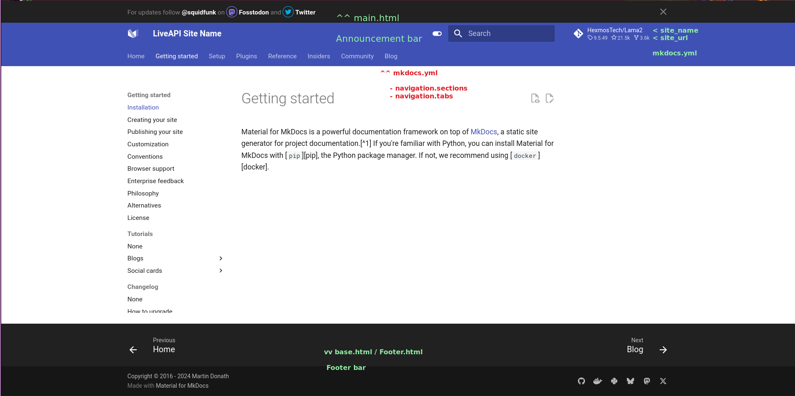

## Installation

### T1

sudo apt install python3.10-venv
python -m venv venv
export PIP_REQUIRE_VIRTUALENV=true
source venv/bin/activate
export PIP_REQUIRE_VIRTUALENV=true
pip install -e ".[recommended]"
pip install nodeenv
nodeenv -p -n lts
npm install
npm start

## T2

source venv/bin/activate
mkdocs serve --watch-theme

## Todo

1. Use Arial / Helvatica font
2. Use media query and auto select light or dark mode
3. Think of using icons better, there are 8000 Material icons
4. Customer logo and favicon should be given
5. Can Add bottom navbar to go for next or previous API
6. Can Add Google Analytics for each doc
7. Can Add cookie consent
8. Can Use Built-in privacy plugin
9. Tabs can be added if necessary, inside a tab, many APIs can be present
10. Navigation bar can be sticky
11. Document versioning support is present
12. Our social links with icon can be present in footer (danger too)
13. Projects plugin: One project can have multiple child /Docs (Microservice atchitecture?)
14. Page: title, subtitle, description, icon, status (_New_, _Deprecated_)
15. [Admonition](http://localhost:8000/mkdocs-material/reference/admonitions/#inline-blocks) (notes: Collapsible, ) [Good defaults](http://localhost:8000/mkdocs-material/reference/admonitions/#supported-types)
16. Render a link as a [button ](http://localhost:8000/mkdocs-material/reference/buttons/#usage)
17. Tooltip
18. Mermaid is supported
19. [Grids](http://localhost:8000/mkdocs-material/reference/grids/) and [Highlighting](http://localhost:8000/mkdocs-material/reference/formatting/)
20. [List](http://localhost:8000/mkdocs-material/reference/lists/#using-task-lists), Bullet points, Child points
21. Tooltips

## Goal

https://mintlify.com/docs/api-playground/mdx/configuration

https://medusa.apidog.io/api-4401190/

