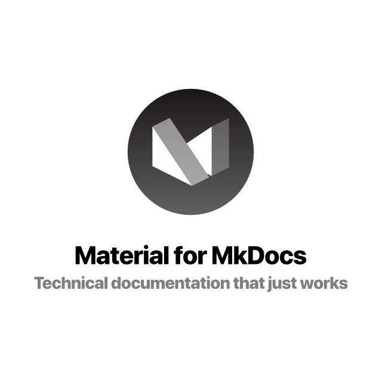
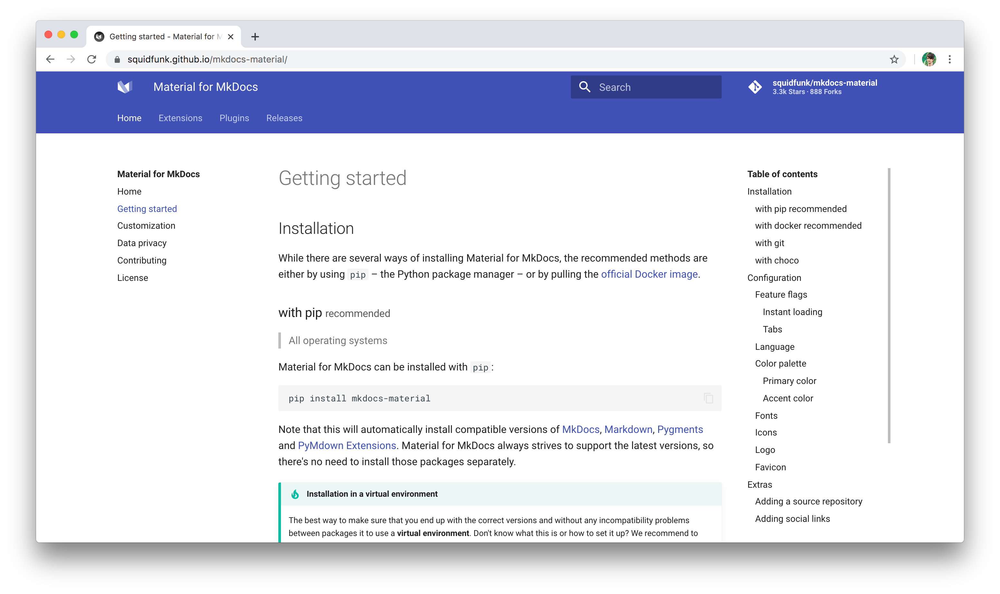

<p align="center">
  
</p>

<p align="center">
  <a href="https://github.com/squidfunk/mkdocs-material/actions">
    
  </a>
  <a href="https://pypistats.org/packages/mkdocs-material">
    
  </a>
  <a href="https://gitter.im/squidfunk/mkdocs-material">
    
  </a>
  <a href="https://gitter.im/squidfunk/mkdocs-material">
    
  </a>
  <a href="https://amzn.to/353WRpj">
    
  </a>
</p>

<p align="center">
  Create a branded static site from a set of Markdown files to host the
  documentation of your Open Source or commercial project – customizable,
  searchable, mobile-friendly, 40+ languages. Set up in 5 minutes.
</p>

<p align="center">
  <a href="https://squidfunk.github.io/mkdocs-material">
    
  </a>
</p>

## Features

* **It's just Markdown** – you just write your technical documentation in
  Markdown, so there's no need to know any HTML, JavaScript or CSS. Material for
  MkDocs will do the heavy lifting and generate a beautiful and functional
  website.

* **Looks great on every device**: Material for MkDocs is built...

## Quick start

Install the latest version of Material for MkDocs with `pip`:

``` sh
pip install mkdocs-material
```

Add the following line to `mkdocs.yml`:

``` yaml
theme:
  name: material
```

For detailed installation instructions and a demo, visit
[squidfunk.github.io/mkdocs-material][1]

  [1]: https://squidfunk.github.io/mkdocs-material/

## License

**MIT License**

Copyright (c) 2016-2020 Martin Donath

Permission is hereby granted, free of charge, to any person obtaining a copy
of this software and associated documentation files (the "Software"), to
deal in the Software without restriction, including without limitation the
rights to use, copy, modify, merge, publish, distribute, sublicense, and/or
sell copies of the Software, and to permit persons to whom the Software is
furnished to do so, subject to the following conditions:

The above copyright notice and this permission notice shall be included in
all copies or substantial portions of the Software.

THE SOFTWARE IS PROVIDED "AS IS", WITHOUT WARRANTY OF ANY KIND, EXPRESS OR
IMPLIED, INCLUDING BUT NOT LIMITED TO THE WARRANTIES OF MERCHANTABILITY,
FITNESS FOR A PARTICULAR PURPOSE AND NON-INFRINGEMENT. IN NO EVENT SHALL THE
AUTHORS OR COPYRIGHT HOLDERS BE LIABLE FOR ANY CLAIM, DAMAGES OR OTHER
LIABILITY, WHETHER IN AN ACTION OF CONTRACT, TORT OR OTHERWISE, ARISING
FROM, OUT OF OR IN CONNECTION WITH THE SOFTWARE OR THE USE OR OTHER DEALINGS
IN THE SOFTWARE.
