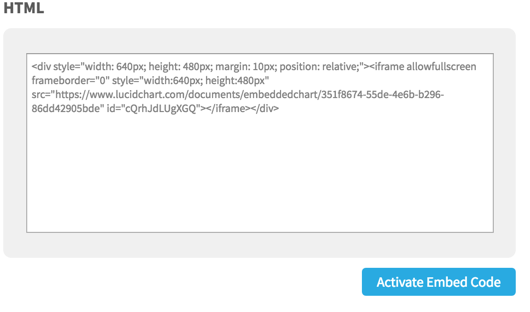

## Through the hoops

open the Lucid chart and select the share -> embed menu item. click the `activate embed code` and copy and past the HTML.



> :bulb: its recomended to change the width to 100% and remove the margin and relative setting under style

```html
<div style="width: 100%; height: 520px;">  
<iframe allowfullscreen frameborder="0"
style="width:100%; height:520px"
src="https://www.lucidchart.com/documents/embeddedchart/ee9393c4-427d-4390-97da-1d0a42b5823e"
id="n8kd1lbHuhin">
</iframe>
</div>
```

<div style="width: 100%; height: 600px;">
<iframe allowfullscreen frameborder="0" style="width:100%; height:600px" src="https://www.lucidchart.com/documents/embeddedchart/ee9393c4-427d-4390-97da-1d0a42b5823e"
id="n8kd1lbHuhin"></iframe>
</div>
