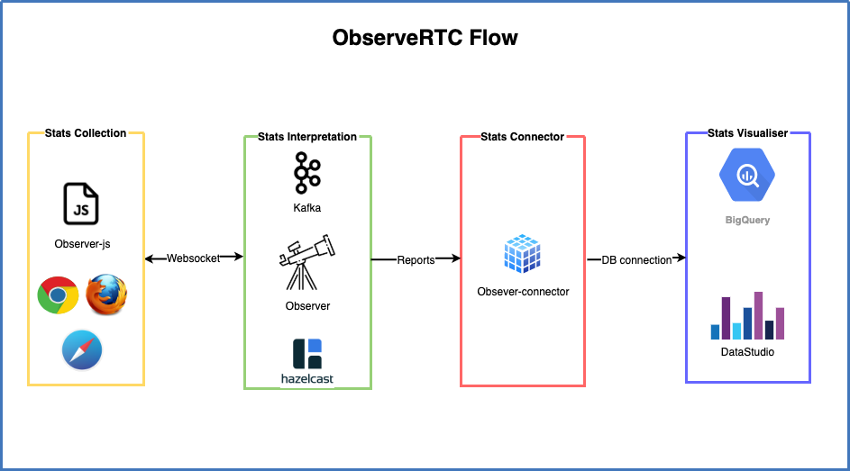

# ObserveRTC

ObserveRTC is an open source initiative aimed to provide tools to collect, interpret, and visualize WebRTC metrics in real-time.

## Benefits of collecting WebRTC stats

* Performance tuning - Ability to debug/improve your WebRTC applications.
* Regression analysis - Quantify the impact of changes you made. 
* System operations - Measure and monitor the performance of your application.
* Troubleshooting & debugging - Investigate technical issues. 
* Usage trends - Track/Undetstand how your app is used. 

## Use cases

**As an application developer** you can use ObserveRTC to debug your WebRTC applications.

**As a product owner** you can use ObserveRTC to measure and monitor the performance of your application.

**As an operations team member** you can monitor the health and get critical alerts about your application. 

## Why to choose ObserveRTC?

* Open source and designed to be integrated with other open-source solutions.
* Own the data from your applications and run further analysis. 
* Designed for the cloud. When the size of your memory and compute requirements increase, new resources can be dynamically added to your cluster to scale elastically. e.g. [hazelcast](https://hazelcast.org) as an in-memory distributed databse for resiliance. 

