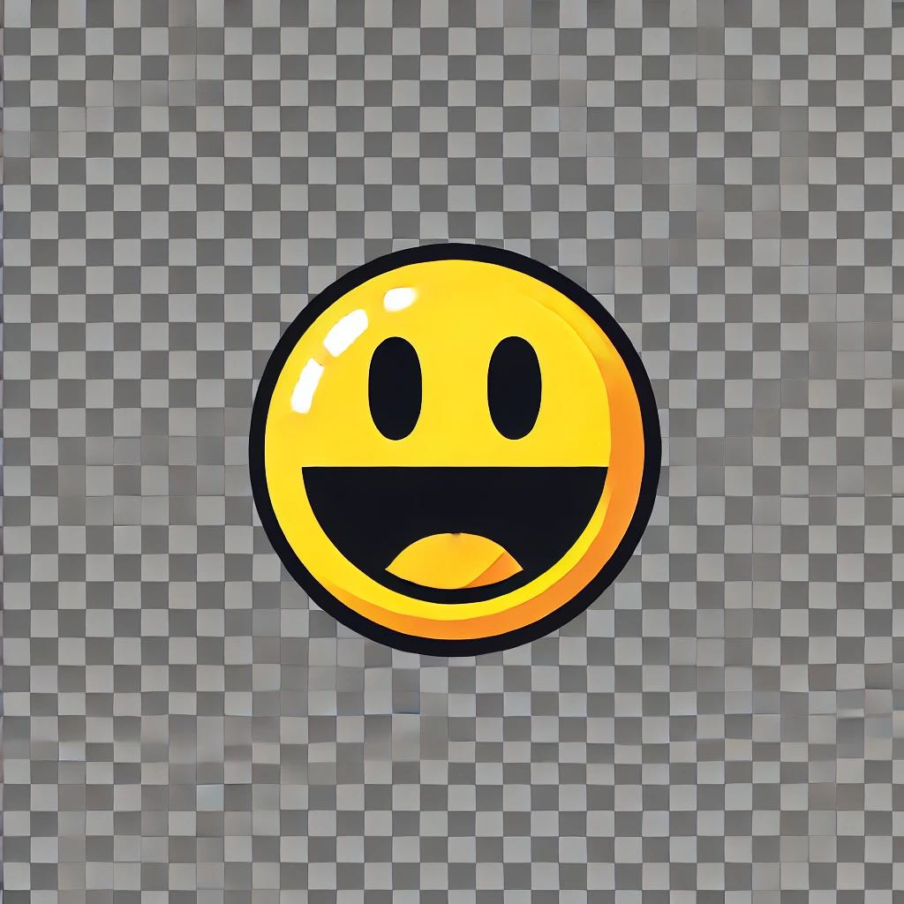

# Pac-Man


**pip install pygame**

```python
import pygame
import random

# Initialize Pygame
pygame.init()

# Screen dimensions
SCREEN_WIDTH = 606
SCREEN_HEIGHT = 606

# Colors (modern palette)
BLACK = (0, 0, 0)
NAVY_BLUE = (28, 28, 160)
WHITE = (255, 255, 255)
PACMAN_COLOR = (255, 255, 0)
GHOST_COLORS = [(255, 0, 0), (255, 184, 255), (0, 255, 255), (255, 184, 82)]

# Set up the display
screen = pygame.display.set_mode((SCREEN_WIDTH, SCREEN_HEIGHT))
pygame.display.set_caption("Modern Pac-Man")

# Clock to control the frame rate
clock = pygame.time.Clock()

# Define the wall layout
wall_list = pygame.sprite.Group()
all_sprites_list = pygame.sprite.Group()

# Define the pellet layout
pellet_list = pygame.sprite.Group()

# Define classes
class Wall(pygame.sprite.Sprite):
    def __init__(self, x, y, width, height, color=NAVY_BLUE):
        super().__init__()
        self.image = pygame.Surface([width, height])
        self.image.fill(color)
        self.rect = self.image.get_rect()
        self.rect.top = y
        self.rect.left = x

class Player(pygame.sprite.Sprite):
    def __init__(self, x, y):
        super().__init__()
        self.image = pygame.Surface([24, 24])
        self.image.fill(BLACK)
        pygame.draw.circle(self.image, PACMAN_COLOR, (12, 12), 12)
        self.rect = self.image.get_rect()
        self.rect.left = x
        self.rect.top = y
        self.change_x = 0
        self.change_y = 0
        self.walls = None
        self.score = 0

    def changespeed(self, x, y):
        self.change_x = x
        self.change_y = y

    def update(self):
        # Move horizontally
        self.rect.left += self.change_x

        # Check for collision
        block_hit_list = pygame.sprite.spritecollide(self, self.walls, False)
        for block in block_hit_list:
            if self.change_x > 0:
                self.rect.right = block.rect.left
            elif self.change_x < 0:
                self.rect.left = block.rect.right

        # Move vertically
        self.rect.top += self.change_y

        # Check for collision
        block_hit_list = pygame.sprite.spritecollide(self, self.walls, False)
        for block in block_hit_list:
            if self.change_y > 0:
                self.rect.bottom = block.rect.top
            elif self.change_y < 0:
                self.rect.top = block.rect.bottom

class Ghost(pygame.sprite.Sprite):
    def __init__(self, x, y, color):
        super().__init__()
        self.image = pygame.Surface([24, 24])
        self.image.fill(BLACK)
        pygame.draw.circle(self.image, color, (12, 12), 12)
        self.rect = self.image.get_rect()
        self.rect.left = x
        self.rect.top = y
        self.change_x = random.choice([-2, 2])
        self.change_y = random.choice([-2, 2])
        self.walls = None

    def update(self):
        self.rect.left += self.change_x
        self.rect.top += self.change_y

        # Change direction upon collision with walls
        block_hit_list = pygame.sprite.spritecollide(self, self.walls, False)
        if block_hit_list:
            self.change_x *= -1
            self.change_y *= -1

# Create the maze layout
def setup_maze():
    # List containing walls [x, y, width, height]
    walls = [
        [0, 0, 6, 606],
        [0, 0, 606, 6],
        [600, 0, 6, 606],
        [0, 600, 606, 6],
        [300, 0, 6, 66],
        [66, 66, 132, 6],
        [66, 66, 6, 132],
        [66, 192, 132, 6],
        [192, 66, 6, 132],
        [66, 300, 132, 6],
        [66, 300, 6, 132],
        [66, 426, 132, 6],
        [192, 300, 6, 132],
        [300, 66, 6, 132],
        [300, 192, 132, 6],
        [426, 66, 6, 132],
        [300, 300, 132, 6],
        [300, 300, 6, 132],
        [426, 300, 6, 132],
        [192, 192, 222, 6],
        [192, 192, 6, 222],
        [192, 408, 222, 6],
        [408, 192, 6, 222],
    ]

    for wall in walls:
        wall = Wall(wall[0], wall[1], wall[2], wall[3])
        wall_list.add(wall)
        all_sprites_list.add(wall)

def create_pellets():
    for row in range(19):
        for column in range(19):
            x = (column * 32) + 12
            y = (row * 32) + 12
            pellet = Pellet(x, y)
            if not pygame.sprite.spritecollide(pellet, wall_list, False):
                pellet_list.add(pellet)
                all_sprites_list.add(pellet)

class Pellet(pygame.sprite.Sprite):
    def __init__(self, x, y):
        super().__init__()
        self.image = pygame.Surface([4, 4])
        self.image.fill(WHITE)
        self.rect = self.image.get_rect()
        self.rect.center = (x, y)

def main():
    # Create the maze
    setup_maze()

    # Create the player object
    player = Player(303 - 16, (7 * 60) + 19)
    player.walls = wall_list

    all_sprites_list.add(player)

    # Create ghosts
    ghost_list = pygame.sprite.Group()

    ghost_positions = [
        (303 - 16, (3 * 60) + 19),
        (303 - 16, (4 * 60) + 19),
        (303 - 16 - 32, (4 * 60) + 19),
        (303 - 16 + 32, (4 * 60) + 19)
    ]

    for idx, position in enumerate(ghost_positions):
        ghost = Ghost(position[0], position[1], GHOST_COLORS[idx])
        ghost.walls = wall_list
        ghost_list.add(ghost)
        all_sprites_list.add(ghost)

    # Create pellets
    create_pellets()

    # Main game loop
    done = False

    # Movement variables
    change_x = 0
    change_y = 0

    while not done:
        # Process events
        for event in pygame.event.get():
            if event.type == pygame.QUIT:
                done = True

            # Handle key presses
            if event.type == pygame.KEYDOWN:
                if event.key == pygame.K_LEFT:
                    change_x = -3
                    change_y = 0
                    player.changespeed(change_x, change_y)
                if event.key == pygame.K_RIGHT:
                    change_x = 3
                    change_y = 0
                    player.changespeed(change_x, change_y)
                if event.key == pygame.K_UP:
                    change_y = -3
                    change_x = 0
                    player.changespeed(change_x, change_y)
                if event.key == pygame.K_DOWN:
                    change_y = 3
                    change_x = 0
                    player.changespeed(change_x, change_y)

        # Update sprites
        player.update()
        ghost_list.update()

        # Check for collisions between Pac-Man and pellets
        pellets_eaten = pygame.sprite.spritecollide(player, pellet_list, True)
        player.score += len(pellets_eaten)

        # Check for collisions between Pac-Man and ghosts
        if pygame.sprite.spritecollideany(player, ghost_list):
            # Game over
            done = True
            print("Game Over! Your score: ", player.score)

        # Clear the screen
        screen.fill(BLACK)

        # Draw all sprites
        all_sprites_list.draw(screen)

        # Display the score
        font = pygame.font.SysFont('Calibri', 24)
        score_text = font.render("Score: " + str(player.score), True, WHITE)
        screen.blit(score_text, [10, 10])

        # Update the screen
        pygame.display.flip()

        # Limit the frame rate
        clock.tick(60)

    pygame.quit()

if __name__ == "__main__":
    main()
```
---

### Key Features:

Modern Design: The game features a dark background with vibrant colors for Pac-Man and ghosts, providing a contemporary aesthetic.

#### Visual Effects:

Smooth movement animations for characters.

Clean and modern maze layout.


#### Gameplay Enhancements:

Basic ghost AI that changes direction upon wall collisions.

Pellet collection system with scoring.

Collision detection for game over conditions.


## How to Run:

1. Save the Code:
- Save the code above in a file named modern_pacman.py.
2. Run the Game:
- Execute the script using Python: python modern_pacman.py
3. Controls:

- Left Arrow: Move left.

- Right Arrow: Move right.

- Up Arrow: Move up.

- Down Arrow: Move down.

---

#### Additional Notes:

> Dependencies: Ensure you have pygame installed (pip install pygame).
> 
> No External Assets Required: This code uses simple shapes for characters, so you don't need external image files. However, you can replace them with custom images for a more polished look.
> 
> Maze Design: The maze layout is defined in the setup_maze function. You can modify the walls to create more intricate designs.
> 
> Ghost AI: The ghosts have a basic AI that reverses their direction upon hitting a wall. For a more challenging game, you can implement pathfinding algorithms like A* or more complex behaviors.
> 
> Pellet Placement: Pellets are placed in positions not occupied by walls. You can adjust their size or appearance in the Pellet class.
> 
> Sound Effects: To add sound effects, you can load and play sounds using pygame.mixer. For example:
> 
> pygame.mixer.init()
> chomp_sound = pygame.mixer.Sound('chomp.wav')
> chomp_sound.play()


#### Customization Ideas:

  Animated Sprites: Replace the simple shapes with animated sprites for Pac-Man and ghosts to enhance the visual appeal.
  
  Power-Ups: Implement power pellets that allow Pac-Man to eat ghosts temporarily.
  
  Scoreboard: Add a high score system that saves scores between sessions.
  
  Levels: Introduce multiple levels with increasing difficulty.

  


