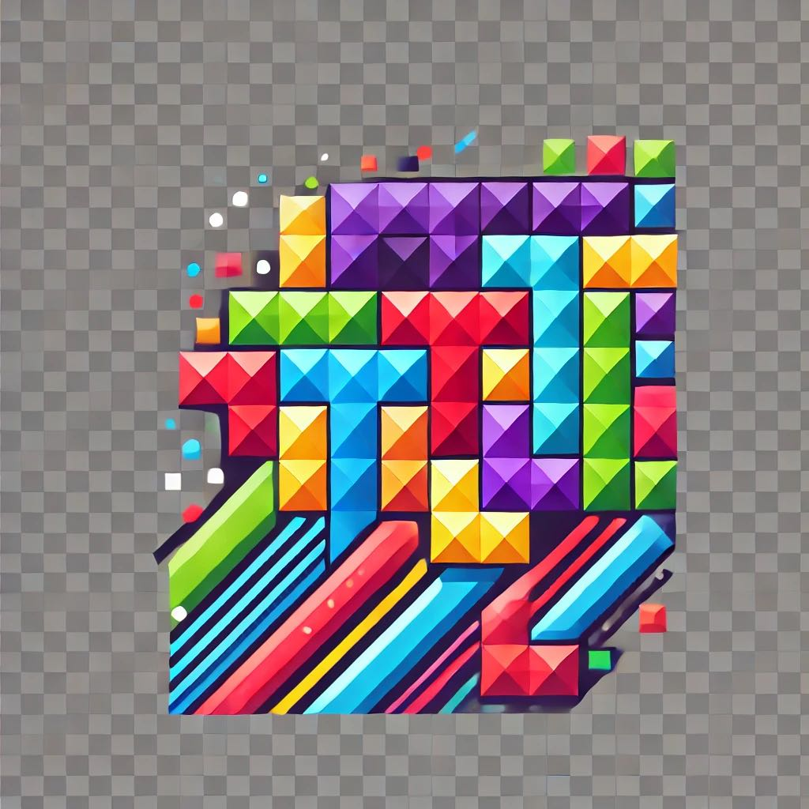

# Tetris


pip install pygame

```python
import pygame
import random

# Initialize Pygame
pygame.init()

# Screen dimensions
SCREEN_WIDTH = 400
SCREEN_HEIGHT = 500
BLOCK_SIZE = 20

# Grid dimensions
GRID_WIDTH = SCREEN_WIDTH // BLOCK_SIZE
GRID_HEIGHT = SCREEN_HEIGHT // BLOCK_SIZE

# Define colors (modern palette)
COLORS = [
    (0, 0, 0),        # Black
    (255, 85, 85),    # Red
    (100, 200, 115),  # Green
    (120, 108, 245),  # Blue
    (255, 140, 50),   # Orange
    (50, 120, 52),    # Dark Green
    (146, 202, 73),   # Lime
    (150, 161, 218),  # Lavender
]

# Define shapes
SHAPES = [
    [['.....',
      '.....',
      '..0..',
      '..0..',
      '..0..',
      '..0..',
      '.....']],
    [['.....',
      '.....',
      '..00.',
      '..00.',
      '.....']],
    [['.....',
      '.....',
      '.00..',
      '..00.',
      '.....']],
    [['.....',
      '.....',
      '..00.',
      '.00..',
      '.....']],
    [['.....',
      '.....',
      '..0..',
      '.000.',
      '.....']],
    [['.....',
      '.....',
      '.000.',
      '...0.',
      '.....']],
    [['.....',
      '.....',
      '.000.',
      '.0...',
      '.....']],
]

class Piece:
    def __init__(self, x, y, shape):
        self.x = x
        self.y = y
        self.shape = shape
        self.color = random.randint(1, len(COLORS)-1)
        self.rotation = 0

def create_grid(locked_positions={}):
    grid = [[(0, 0, 0) for _ in range(GRID_WIDTH)] for _ in range(GRID_HEIGHT)]

    for i in range(GRID_HEIGHT):
        for j in range(GRID_WIDTH):
            if (j, i) in locked_positions:
                c = COLORS[locked_positions[(j, i)]]
                grid[i][j] = c
    return grid

def convert_shape_format(piece):
    positions = []
    shape_format = piece.shape[piece.rotation % len(piece.shape)]

    for i, line in enumerate(shape_format):
        row = list(line)
        for j, column in enumerate(row):
            if column == '0':
                positions.append((piece.x + j - 2, piece.y + i - 4))
    return positions

def valid_space(piece, grid):
    accepted_positions = [[(j, i) for j in range(GRID_WIDTH) if grid[i][j] == (0,0,0)] for i in range(GRID_HEIGHT)]
    accepted_positions = [j for sub in accepted_positions for j in sub]

    formatted = convert_shape_format(piece)

    for pos in formatted:
        if pos not in accepted_positions:
            if pos[1] > -1:
                return False
    return True

def check_lost(positions):
    for pos in positions:
        x, y = pos
        if y < 1:
            return True
    return False

def get_shape():
    return Piece(GRID_WIDTH//2, 0, random.choice(SHAPES))

def draw_text_middle(surface, text, size, color):
    font = pygame.font.SysFont('Calibri', size, bold=True)
    label = font.render(text, 1, color)

    surface.blit(label, (SCREEN_WIDTH / 2 - (label.get_width() / 2), SCREEN_HEIGHT / 2 - label.get_height() / 2))

def clear_rows(grid, locked):
    increment = 0
    for i in range(GRID_HEIGHT-1, -1, -1):
        row = grid[i]
        if (0,0,0) not in row:
            increment += 1
            ind = i
            for j in range(GRID_WIDTH):
                try:
                    del locked[(j, i)]
                except:
                    continue

    if increment > 0:
        for key in sorted(list(locked), key=lambda x: x[1])[::-1]:
            x, y = key
            if y < ind:
                newKey = (x, y + increment)
                locked[newKey] = locked.pop(key)

def draw_grid(surface, grid):
    for i in range(GRID_HEIGHT):
        for j in range(GRID_WIDTH):
            pygame.draw.rect(surface, grid[i][j], (j*BLOCK_SIZE, i*BLOCK_SIZE, BLOCK_SIZE, BLOCK_SIZE), 0)

    # Grid lines
    for i in range(GRID_HEIGHT):
        pygame.draw.line(surface, (128,128,128), (0, i*BLOCK_SIZE), (SCREEN_WIDTH, i*BLOCK_SIZE))
    for j in range(GRID_WIDTH):
        pygame.draw.line(surface, (128,128,128), (j*BLOCK_SIZE, 0), (j*BLOCK_SIZE, SCREEN_HEIGHT))

def draw_next_shape(piece, surface):
    font = pygame.font.SysFont('Calibri', 30)
    label = font.render('Next Shape', 1, (255,255,255))

    sx = SCREEN_WIDTH + 50
    sy = SCREEN_HEIGHT/2 - 100
    shape_format = piece.shape[piece.rotation % len(piece.shape)]

    for i, line in enumerate(shape_format):
        row = list(line)
        for j, column in enumerate(row):
            if column == '0':
                pygame.draw.rect(surface, COLORS[piece.color], (sx + j*BLOCK_SIZE, sy + i*BLOCK_SIZE, BLOCK_SIZE, BLOCK_SIZE), 0)

    surface.blit(label, (sx + 10, sy - 30))

def update_score(nscore):
    with open('scores.txt', 'r') as f:
        lines = f.readlines()
        score = lines[0].strip()

    with open('scores.txt', 'w') as f:
        if int(score) > nscore:
            f.write(str(score))
        else:
            f.write(str(nscore))

def main():
    locked_positions = {}
    grid = create_grid(locked_positions)

    change_piece = False
    run = True
    current_piece = get_shape()
    next_piece = get_shape()
    clock = pygame.time.Clock()
    fall_time = 0
    fall_speed = 0.27
    level_time = 0
    score = 0

    screen = pygame.display.set_mode((SCREEN_WIDTH, SCREEN_HEIGHT))
    pygame.display.set_caption('Modern Tetris')

    while run:
        grid = create_grid(locked_positions)
        fall_time += clock.get_rawtime()
        level_time += clock.get_rawtime()
        clock.tick()

        # Increase speed every 60 seconds
        if level_time/1000 > 60:
            level_time = 0
            if fall_speed > 0.12:
                fall_speed -= 0.005

        # Piece falling
        if fall_time/1000 > fall_speed:
            fall_time = 0
            current_piece.y +=1
            if not valid_space(current_piece, grid) and current_piece.y > 0:
                current_piece.y -=1
                change_piece = True

        # Event handling
        for event in pygame.event.get():
            if event.type == pygame.QUIT:
                run = False
                pygame.display.quit()
                quit()

            if event.type == pygame.KEYDOWN:
                if event.key == pygame.K_LEFT:
                    current_piece.x -=1
                    if not valid_space(current_piece, grid):
                        current_piece.x +=1
                elif event.key == pygame.K_RIGHT:
                    current_piece.x +=1
                    if not valid_space(current_piece, grid):
                        current_piece.x -=1
                elif event.key == pygame.K_DOWN:
                    current_piece.y +=1
                    if not valid_space(current_piece, grid):
                        current_piece.y -=1
                elif event.key == pygame.K_UP:
                    current_piece.rotation +=1
                    if not valid_space(current_piece, grid):
                        current_piece.rotation -=1

        shape_pos = convert_shape_format(current_piece)

        # Add piece to the grid for drawing
        for i in range(len(shape_pos)):
            x, y = shape_pos[i]
            if y > -1:
                grid[y][x] = COLORS[current_piece.color]

        # Piece hit the ground
        if change_piece:
            for pos in shape_pos:
                p = (pos[0], pos[1])
                locked_positions[p] = current_piece.color
            current_piece = next_piece
            next_piece = get_shape()
            change_piece = False
            # Clear rows and increase score
            clear_rows(grid, locked_positions)
            score += 10

        draw_grid(screen, grid)
        draw_next_shape(next_piece, screen)
        pygame.display.update()

        # Check for loss
        if check_lost(locked_positions):
            draw_text_middle(screen, "GAME OVER", 80, (255,255,255))
            pygame.display.update()
            pygame.time.delay(2000)
            run = False
            update_score(score)

    pygame.quit()

if __name__ == '__main__':
    main()

```

---
## Key Features:

Modern Design: The game uses a sleek dark background with vibrant, modern colors for the Tetris pieces.

Visual Effects:

Smooth falling animations.

Line clear animations can be added for extra effect.


Gameplay Enhancements:

The game speeds up over time.

Next piece preview.

Score tracking and high score saving.


How to Run:

1. Save the Code: Save the code above in a file named modern_tetris.py.


2. Run the Game: Execute the script using Python:

python modern_tetris.py


3. Controls:

Left Arrow: Move piece left.

Right Arrow: Move piece right.

Up Arrow: Rotate piece.

Down Arrow: Move piece down faster.


#### Additional Effects:

  Line Clear Animation: You can add animations when a line is cleared by modifying the clear_rows function.
  
  Background Music and Sound Effects: Incorporate the pygame.mixer module to add sound effects.
  
  Particle Effects: For advanced visual effects, you might integrate particle systems when pieces lock into place.

