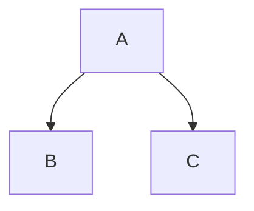
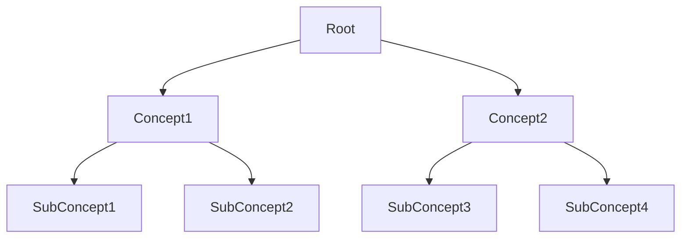

# Mastering Markdown for System Architecture

# Mastering Markdown for System Architecture 🖥️

## What is Markdown? 🖥️

Markdown is my go-to tool for almost everything I document, both at work and at home. As a systems architect, I need my documentation to be efficient, adaptable, and precise. Markdown is a lightweight markup language with a simplified syntax that allows me to format text without diving into complex HTML or other cumbersome languages. It lets me quickly produce **bold** text, *italicized* text, [hyperlinks](https://github.com/mostrub), and more, giving me all the essential tools I need without the bloat.

## How I Use Markdown Daily 🏗️

Markdown's versatility has made it essential in many areas of my work. Here are some ways I use Markdown:

- **GitHub**: For README files, comments, and documentation, Markdown is essential for clear developer communication. It's the backbone of how I present my projects and repositories.
- **Slack and Discord**: I use Markdown to format messages and share structured information with my team, making communication clearer and more efficient.
- **Documentation Websites**: Static site generators like Jekyll and Docusaurus make it easy for me to create and manage web content using Markdown as the primary input format. This helps streamline project documentation with minimal effort.
- **Internal Notes**: I rely on Markdown for all of my internal notes and system architecture drafts. The straightforward structure is perfect for organizing complex technical details.

## Why Markdown Works So Well for Me ⚙️

Markdown works like the perfect drafting table—a streamlined, specialized tool that lets me focus on creating quality content rather than wrestling with formatting tools. When I'm documenting a new architecture or drafting technical specifications, I need to concentrate on the content. Markdown's minimalistic syntax lets me do just that, without the distraction of clunky formatting menus.

Once you become familiar with Markdown, the efficiency it offers is unmatched. It allows me to stay focused, making it perfect for technical documentation, notes, or even drafting emails and proposals. Its straightforward, yet powerful, features make it highly effective.

## What Can Markdown Do for You? 🛡️

Here are some basics of what you can do with Markdown:

- `# Headings`: Adding more `#` symbols results in progressively smaller headings. For instance, `## Heading` creates a second-level heading.
- **Italic** and **bold** text using simple characters: *italic* and **bold**.
- [Link](https://github.com/mostrub) to provide clickable references.
- ~~Line-through~~ for striking through text.
- `Inline code` for in-line snippets of code or commands.

These capabilities provide a foundation for creating clear, structured content without unnecessary complexity.

### Advanced Features with GitHub-Flavored Markdown 🛠️

Since my work often involves coding and system design, [GitHub-Flavored Markdown](https://docs.github.com/en/get-started/writing-on-github/getting-started-with-writing-and-formatting-on-github/basic-writing-and-formatting-syntax) (GFM) has been incredibly valuable. It includes additional features that meet specific developer needs:

- **Fenced Code Blocks**: I can easily denote blocks of code using triple backticks (\`\`\`) and specify languages for syntax highlighting, which is crucial when creating examples or technical documentation.

Examples:

````md
```js
function helloWorld() {
  console.log("Hello, world!");
}
```

```python
def hello_world():
    print("Hello, world!")

hello_world()
```
````

- **Task Lists**: Useful for managing to-do items within project documentation.

```md
- [ ] Task item 1
- [x] Completed task item 2
```

- **Mermaid Diagrams**: Markdown's integration with Mermaid lets me create diagrams and flowcharts directly from text, which is great for system planning and architecture. Here's an example mind map:

````md

````

- **Mathematical Expressions**: LaTeX-style mathematical notation is great for when I need to document precise technical formulas.

````md
```math
E = mc^2
```
````

## My Markdown Tools 🧰

### Visual Studio Code (VS Code)

VS Code is my primary editor for working with Markdown. It has excellent support for Markdown, including a live preview feature that makes editing quick and intuitive. Extensions like "Markdown All in One" and "Markdown Preview Enhanced" are indispensable for generating tables of contents automatically, customizing styles, and integrating Markdown with other tools. I can view the formatting live alongside my text, which speeds up the drafting and review process immensely.

### Mark Text

Mark Text is another editor I use occasionally. It's an open-source WYSIWYG editor that makes Markdown very accessible, particularly for those who are new to it. The focus mode is helpful when I need to avoid distractions and just concentrate on writing.

These editors, along with Pandoc, make Markdown documentation not only feasible but enjoyable. For anyone getting started, these tools offer a powerful, easy-to-use introduction to the world of Markdown.

## Markdown in Action 🔍

### Example: Interactive Mind Map for GitHub Pages

I often use GitHub Pages to host my documentation, and one of the ways I make content more interactive is by embedding Mermaid diagrams. Mind maps can be very helpful for showing relationships in system architecture or planning projects. Below is a Markdown snippet that will work perfectly on a GitHub static webpage:



By adding this snippet to my GitHub Pages repository, I can provide a dynamic, visual representation of how different components are interconnected, which greatly aids in communicating complex ideas to my team or stakeholders.

## Bringing It All Together 🚀

Markdown is an integral part of my daily workflow. I use it for everything from drafting technical specifications to organizing my thoughts. With VS Code and the right extensions, Markdown provides a fast and seamless editing experience. The combination of Markdown and Pandoc allows me to export my work into various formats, including HTML, PDF, and Microsoft business-related formats such as DOCX, with an efficiency that traditional word processors can't match—especially when these processes are automated as part of my workflow. Additionally, OneDrive for Business fully supports Markdown, along with over 300 different file formats, making it even easier to integrate my work into cloud storage and collaboration systems. cloud storage and collaboration systems. For more details on supported file types, you can refer to [Microsoft's official documentation](https://support.microsoft.com/en-us/office/file-types-supported-for-previewing-files-in-onedrive-sharepoint-and-teams-e054cd0f-8ef2-4ccb-937e-26e37419c5e4).

The minimal syntax of Markdown helps me stay focused on what matters most: the content itself. Whether I'm documenting a system architecture, creating diagrams, or drafting a proposal, Markdown's flexibility lets me do it all without the headache. And thanks to its seamless integration with GitHub, I can set up workflows with GitHub Actions to automatically convert Markdown to HTML, deploy updates, or generate PDFs whenever changes are pushed to a repository. You can check out more on my [GitHub account](https://github.com/mostrub) where I use these automations to keep my documentation efficient and consistent.

Markdown isn't just a tool—it's a methodology that keeps my work structured, precise, and adaptable. Its straightforward syntax and powerful extensions make it indispensable for anyone needing to communicate complex ideas clearly and efficiently. Moreover, once you're comfortable with Markdown, picking up other markup languages becomes a breeze because of their shared foundational concepts. In my world of systems architecture, Markdown is simply the most effective way to translate thoughts into shareable, clear, and actionable documentation.

Robot_Invasion

