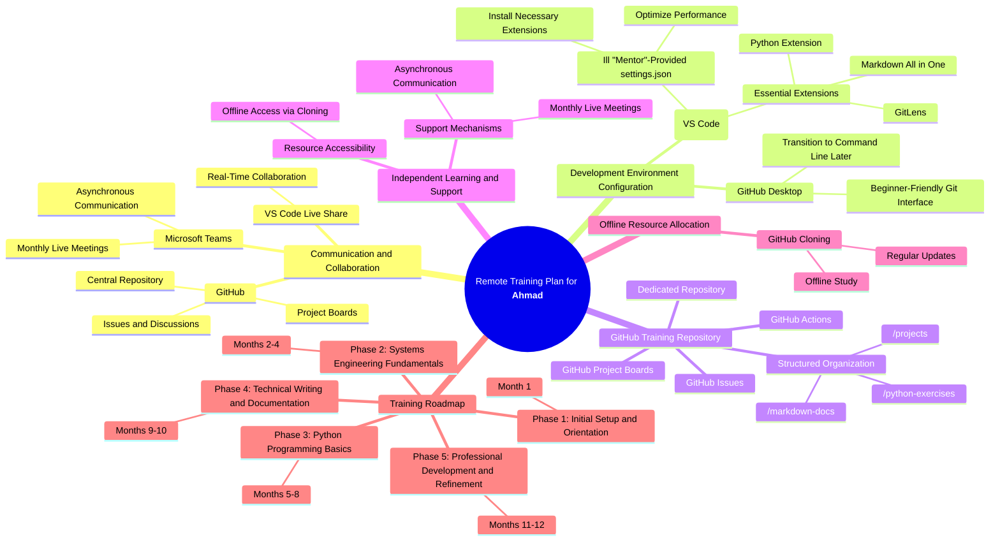

# Roadmap for Ahmed

# Index

1. [Roadmap Summary](#roadmap-summe)
2. [Key Components of the Training Plan](#key-components-of-the-training-plan)
   - [Communication and Collaboration](#communication-and-collaboration)
   - [Development Environment Configuration](#development-environment-configuration)
   - [GitHub Training Repository Configuration](#github-training-repository-configuration)
   - [Independent Learning and Support Mechanisms](#independent-learning-and-support-mechanisms)
   - [Offline Resource Allocation for Limited Connectivity](#offline-resource-allocation-for-limited-connectivity)
3. [Roadmap Collaboration](#roadmap-collaboration)
4. [Tools Overview](#tools-overview)
   - [Microsoft Teams](#microsoft-teams)
   - [GitHub Tools](#github-tools)
   - [Development Environment Configuration](#development-environment-configuration-2)
5. [GitHub Training Repository Configuration](#github-training-repository-configuration-2)
6. [Interactive Workspace Development](#interactive-workspace-development)
7. [Technical Documentation Using Markdown](#technical-documentation-using-markdown)
8. [VS Code Live Share for Real-Time Collaboration](#vs-code-live-share-for-real-time-collaboration)
9. [Offline Resource Allocation for Limited Connectivity](#offline-resource-allocation-for-limited-connectivity-2)
10. [GitHub README](#github-readme)

## Roadmap Summe

> The training plan is tailored to provide **Ahmad** with a comprehensive remote learning experience over approximately 12-15 Months. Due to time constraints—training sessions are limited to once every 2 weeks or any time via chat in Teams and the new Project Board that is explained in the GitHub Section of this document. The plan emphasizes independent learning, supported by scheduled live meetings and asynchronous communication. The goal is to enable **Ahmad** to work independently while ensuring he has access to guidance and support when needed.



**Key Components of the Training Plan:**

1. **Communication and Collaboration:**

   - **Microsoft Teams:** Serves as the primary platform for asynchronous communication and monthly live meetings. Ahmad can use Teams to ask questions and seek guidance whenever he encounters challenges between live sessions.

   - **VS Code Live Share:** Used during monthly live meetings for real-time collaboration. This tool allows Ahmad and "Mentor" to work together on code, facilitating immediate feedback and hands-on guidance within the limited live interaction time.

   - **GitHub:** Acts as the central collaboration platform. Ahmad will work independently on tasks and projects within the GitHub repository, using GitHub Issues and Project Boards to communicate his progress and any challenges he faces.

2. **Development Environment Configuration:**

   - **Visual Studio Code (VS Code):** Ahmad's primary development environment, configured with essential extensions to support independent development:

     - **Python Extension:** For writing, executing, and debugging Python scripts.
     - **Markdown All in One:** For creating and managing structured documentation.
     - **GitLens:** To understand the evolution of the codebase and enhance Git proficiency.

   - **Customized Settings:** A tailored `settings.json` file will optimize VS Code for Ahmad's system, enhancing performance and streamlining his workflow.

3. **GitHub Training Repository Configuration:**

   - **Dedicated GitHub Repository:** Acts as the central hub for exercises, documentation, and projects. It supports Ahmad's development in collaborative workflows, source control, and codebase management.

   - **Structured Organization:** The repository contains distinct directories for Python programming exercises, Markdown documentation, and completed projects to facilitate self-guided learning.

   - **GitHub Project Boards:** Tasks and milestones are outlined on Project Boards, allowing Ahmad to track his progress independently. "Mentor" can review his progress asynchronously and provide feedback through comments and issues.

   - **GitHub Issues:** Ahmad can create issues to ask questions or highlight challenges during his independent work. "Mentor" will respond to these issues to provide guidance.

   - **GitHub Actions:** Automated workflows provide immediate feedback on code submissions, such as linting and test results, supporting Ahmad's independent learning process.

4. **Independent Learning and Support Mechanisms:**

   - **Asynchronous Communication:** Ahmad is encouraged to communicate questions and updates via Microsoft Teams chat and GitHub Issues, ensuring he receives assistance when needed, despite limited live meeting time.

   - **Resource Accessibility:** All necessary resources are accessible within the GitHub repository, enabling Ahmad to learn and practice at his own pace outside of live sessions.

   - **Monthly Live Meetings:** Scheduled once a month for approximately two hours, these meetings focus on reviewing progress, addressing complex topics, and collaborative coding via VS Code Live Share.

5. **Offline Resource Allocation for Limited Connectivity:**

   - **GitHub Cloning:** Ahmad should regularly clone the repository to maintain offline access to learning materials, enabling him to study independently without continuous internet connectivity.

# Roadmap Collaboration

## Overview

This document outlines the tools and methods for effective collaboration in the training environment. We focus on using Microsoft Teams, GitHub, and Visual Studio Code to build a cohesive learning experience.

## Tools List

- **Microsoft Teams**
- **GitHub**
  - Project Boards
  - Actions
  - Pages
  - Discussions
  - Cloning
  - Training Repository
- **Visual Studio Code (VS Code)**
  - Extensions
  - Live Share
  - Markdown
  - Integrated Terminal

## Tools Overview

### Microsoft Teams

- **Communication**: Microsoft Teams is our main platform for video calls, chat, and discussions, ensuring efficient information sharing.
- **Screen Sharing**: Allows real-time collaboration, troubleshooting, and demonstrating complex tasks during meetings.

### GitHub Tools

- **Project Boards**: GitHub’s Kanban-style Project Boards help organize tasks, track progress, and highlight areas needing attention.
- **Actions**: GitHub Actions automate repetitive tasks like linting Python scripts, validating Markdown files, and running tests. For example, participants can set up a workflow to automatically run unit tests whenever new code is pushed. This automation introduces participants to Continuous Integration (CI) practices, emphasizing the importance of code quality.
- **Pages**: GitHub Pages host static websites straight from the repository, acting as professional portfolios and a centralized hub for training materials. For example, participants can use GitHub Pages to create a portfolio showcasing completed projects, documentation, and tutorials. This helps participants learn about web publishing and project presentation.
- **Discussions**: GitHub Discussions provide an open platform for asking questions, sharing ideas, and collaborating. It also serves as a knowledge base for future reference.
- **Cloning**: Repository cloning gives offline access to learning materials, so participants can continue working without an internet connection. It’s also a good way to learn how to synchronize local and remote repositories—an essential software development skill.
- **Training Repository**: The GitHub Training Repository acts as the main hub for exercises, projects, and documentation. It provides a safe, hands-on environment for learning, allowing contributions without affecting the core project.

## Development Environment Configuration

### Visual Studio Code (VS Code)

- **Extensions**: Install key VS Code extensions, like the Python extension for debugging and executing scripts. Markdown extensions like **Markdown All in One** also help with creating structured documentation by providing live previews, syntax highlighting, and shortcuts.
- **Live Share**: VS Code Live Share allows real-time collaboration, giving participants the opportunity to work together on code and receive immediate feedback. This encourages pair programming, which helps with problem-solving and knowledge transfer.
- **Markdown**: Markdown support in VS Code is great for creating professional documentation. Features like syntax highlighting, live previews, and shortcuts make writing clear and accessible.
- **Integrated Terminal**: The integrated terminal in VS Code lets you run scripts, execute commands, and manage repositories—all from within the editor. This boosts productivity and helps participants get comfortable with command-line tools.

## GitHub Training Repository Configuration

- Set up a dedicated GitHub repository as the main training environment, with separate folders for Python exercises, Markdown documentation, and completed projects to keep things organized.
- Configure repository permissions to limit contributions to specific sections, so participants can safely practice hands-on skills while maintaining resource integrity.
- **GitHub Actions**: Automate workflows like linting, validating documentation, and running tests. This helps introduce participants to CI practices and reinforce good coding standards.
- **GitHub Pages**: Use GitHub Pages to create a site for the training repository, serving as a portfolio and resource hub to display projects and organized documentation.

## Interactive Workspace Development

- Use **GitHub Discussions** to create an interactive workspace. Participants can post questions, share insights, and collaborate. Discussions also serve as a record for reviewing challenging concepts later.

## Technical Documentation Using Markdown

- **Markdown Benefits**: Markdown is simple and effective for creating README files, tutorials, and other project documentation. Its ease of use helps produce professional and clear content.
- **Consistency in Documentation**: Using Markdown consistently improves technical writing skills and ensures that documentation is easy to understand, which is crucial for effective collaboration.

## VS Code Live Share for Real-Time Collaboration

- When possible, use **VS Code Live Share** for synchronous coding sessions. This feature allows participants to work on code together, provide immediate feedback, and get hands-on guidance. It also simulates pair programming, introducing different ways of approaching a problem.

## Offline Resource Allocation for Limited Connectivity

- Use **GitHub Cloning** to maintain offline access to all training materials. By cloning the repository, participants have all the necessary resources even without an internet connection. Regular updates to the clone help participants stay familiar with syncing between local and remote repositories, which is a key skill for modern software development. This approach also minimizes reliance on tools like Google Drive, keeping everything in one place.

## GitHub README

# Training Environment Setup & Collaboration Guide

## 📚 Overview

Welcome to your training repository, Ahmad! This repository is here to provide you with all the resources, exercises, and collaboration tools needed to support your journey. Whether you are working independently or we are collaborating directly, everything here is designed to help you succeed and build your skills step by step.

Cheers,
Marc

## 🚀 Project Overview

We are focusing on the **Project Ahmad Kanban**, which serves as a central management tool to track our progress effectively. You can access the project board [here](https://github.com/users/mostrub/projects/14/views/1). Use the Kanban board to view your tasks, manage ongoing projects, and keep everything on track.

## 🔑 Repository Access & Forking

### Fork the Repository

Follow these steps to access and work with the repository:

1. Visit the [Project Ahmad Repository](https://github.com/mostrub/ProjectAhmad).
2. Click the **"Fork"** button in the top-right corner to create a copy under your GitHub account.
3. Select your account to fork the repository.

### Project Board Access

The **Project Ahmad Kanban** will be available to track all tasks:

- You'll maintain access to view and update tasks on the board.
- All project automation will be maintained with the original board.

### Working with Your Fork

To start working with your forked repository:

1. **Clone your forked repository:**
   ```bash
   git clone https://github.com/YOUR_USERNAME/ProjectAhmad.git
   cd ProjectAhmad
   ```
2. **Add the original repository as an upstream remote:**
   ```bash
   git remote add upstream https://github.com/mostrub/ProjectAhmad.git
   ```
3. **Verify the remotes:**
   ```bash
   git remote -v
   ```

### Staying Updated

To keep your fork updated with the latest changes:

1. Fetch updates from the original repository:
   ```bash
   git fetch upstream
   ```
2. Merge updates into your main branch:
   ```bash
   git merge upstream/main
   ```

## 🛠️ Tools & Technologies

### Primary Collaboration Tools

- **Microsoft Teams** - Main platform for communication and video calls.
- **GitHub** - Version control and project management.
- **Visual Studio Code** - Primary development environment.

### GitHub Features We Use

- **📋 Project Boards** - Task management for tracking ongoing and future work.
- **🔄 GitHub Actions** - Automation for testing, linting, and deploying.
- **🌐 GitHub Pages** - Host documentation and project portfolios.
- **💬 Discussions** - Community-driven Q&A and collaboration.

### 🤖 Kanban Automation

We've implemented automated Kanban board management for streamlined task flow:

- View our **Project Ahmad Kanban** for status updates.
- Automated task movement across board columns.
- GitHub GraphQL API integration for better management.

### Using the Automation Tool

To set up the automation tool:

1. Navigate to the **kanban-automation** directory.
2. Set up your environment:
   ```bash
   cp .env.example .env
   # Add your GitHub token to .env
   ```
3. Install dependencies and run the automation script:
   ```bash
   npm install
   npm start
   ```

## 💻 Development Environment Setup

### VS Code Configuration

**Important:** Ahmad, follow these steps to configure VS Code:

1. Close VS Code completely.
2. Navigate to the `vscode-setup` folder.
3. Run the PowerShell script:
   - Right-click on the script and select **"Run as administrator"**, or
   - Open PowerShell as administrator and execute:
     ```bash
     .\setup-vscode.ps1
     ```
4. This will install all required settings and plugins automatically.

### Repository Structure

```
training-repo/
├── phase1_initial_setup/
│   ├── setup_instructions.md
│   ├── live_meeting_notes.md
│   └── month1_notes.md
├── phase2_systems_engineering/
│   ├── networking_fundamentals.md
│   ├── it_infrastructure.md
│   └── progress_documentation/
│       ├── month2_notes.md
│       ├── month3_notes.md
│       ├── month4_notes.md
│       └── ...
├── phase3_python_basics/
│   ├── calculator_project/
│   │   ├── calculator.py
│   │   └── README.md
│   ├── web_scraper_project/
│   │   ├── scraper.py
│   │   └── README.md
│   ├── automation_scripts/
│   │   ├── script1.py
│   │   └── script2.py
│   └── progress_documentation/
│       ├── month5_notes.md
│       ├── month6_notes.md
│       ├── month7_notes.md
│       ├── month8_notes.md
│       └── ...
├── phase4_technical_writing/
│   ├── project_documentation/
│   │   ├── readme_template.md
│   │   ├── function_documentation.md
│   │   └── tutorial_guide.md
│   ├── github_pages_site/
│   │   ├── index.html
│   └── progress_documentation/
│       ├── month9_notes.md
│       ├── month10_notes.md
│       └── ...
├── phase5_professional_development/
│   ├── linkedin_optimization.md
│   ├── github_project_curation.md
│   ├── capstone_project/
│   │   ├── capstone.py
│   │   ├── README.md
│   └── progress_documentation/
│       ├── month11_notes.md
│       ├── month12_notes.md
│       └── ...
├── phase6_kanban_automation/
│   ├── kanban_automation.md
│   ├── automation_scripts/
│   │   ├── kanban_script1.py
│   │   └── kanban_script2.py
│   └── progress_documentation/
│       ├── month13_notes.md
│       ├── month14_notes.md
│       └── ...
├── .github/
│   ├── workflows/
│   │   ├── linting.yml
│   │   ├── tests.yml
│   │   └── ...
├── README.md
└── GitHub-Pages/
    ├── index.html
    └── ...
```

## 🚀 Getting Started

1. **Clone the Repository**
   ```bash
   git clone https://github.com/mostrub/ProjectAhmad.git
   cd ProjectAhmad
   ```

## 📝 Documentation Guidelines

- Use Markdown for all documentation.
- Follow the templates in `phase4_technical_writing/`.
- Include clear, descriptive commit messages.
- Always update documentation alongside code changes.

## 🤝 Collaboration Features

### VS Code Live Share

- **Real-Time Coding**: Collaborate live, share terminals, and provide instant feedback.
- **Pair Programming**: Use Live Share for coding sessions with the mentor.

### GitHub Integration

- **Automated Workflows** via **GitHub Actions**: Continuous integration, testing, and deployment.
- **Project Boards**: Keep track of assignments and milestones.
- **Code Review Process**: Submit pull requests for mentor feedback.

## 🔒 Repository Permissions

- **Read Access**: Available to all participants for reviewing code.
- **Write Access**: Granted for specific sections within the training area.
- **Protected Branches**: The `main` branch is protected and requires mentor review for pull requests.

## 🌳 Branching Strategy

- **`main`** - Stable, production-ready code.
- **`develop`** - Integration of ongoing development work.
- **`feature/*`** - New features in progress.
- **`bugfix/*`** - Addressing reported issues.
- **`release/*`** - Preparation for new releases.
- **`hotfix/*`** - Quick fixes for production issues.

## 📏 Coding Standards

### Python

- Follow **PEP 8** style guidelines.
- Keep line length to a maximum of **88 characters**.
- **Use Type Hints** for all functions and methods.
- Document functions thoroughly using **docstrings**.

### Documentation

- Use **British English** for consistency.
- Adhere to the **Microsoft Writing Style Guide**.
- Include practical **code examples** where applicable.
- Ensure all **headings** are in **Title Case**.

---

_For more information, visit our [GitHub Pages site](https://mostrub.github.io/ProjectAhmad/) or reach out via LinkedIn._
