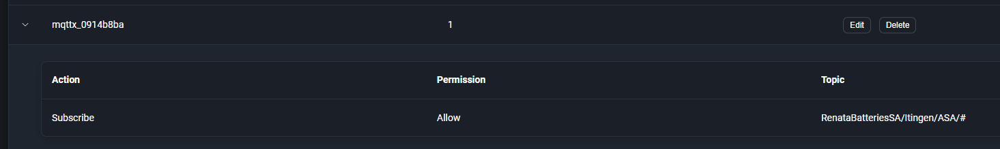

# ASA PASS 

* 
* Device name	Device ID	Managed by	Creator	OS	OS Version	Domain	Tailscale version	Tags	Created	Last seen	Key expiry	Tailscale IPs	Endpoints	Subnet router	Approved subnet routes	Unapproved subnet routes	Exit node	Ephemeral	Shared in	Tailscale SSH	Funnel

* srv-asa01	nJ7b8Gcdr211CNTRL	mostrub@LIVE.DE	mostrub@LIVE.DE	windows	10.0.20348.2700	srv-asa01.falcon-polaris.ts.net	1.76.3-t02acaa00e-g551df6588		2024-07-04T07:51:00Z	2024-11-07T20:54:14Z	2024-12-31T07:51:00Z	100.122.187.27,fd7a:115c:a1e0::1901:bb1b									
* rendev01	nV6JsVUhf821CNTRL	mostrub@LIVE.DE	mostrub@LIVE.DE	windows	10.0.26100.2161	rendev01.falcon-polaris.ts.net	1.76.3-t02acaa00e-g551df6588		2024-11-06T09:01:59Z		0001-01-01T00:00:00Z	100.78.58.124,fd7a:115c:a1e0::5901:3a7d									
* dsk-asa01	nzSFjHs4hD11CNTRL	rko@autexis.ch	rko@autexis.ch	windows	10.0.19044.4780	dsk-asa01.falcon-polaris.ts.net	1.76.3-t02acaa00e-g551df6588		2024-11-04T16:30:04Z	2024-11-07T20:53:44Z	2025-05-03T16:30:04Z	100.88.136.73,fd7a:115c:a1e0::2901:8849									
* lap-26	n88mpwUPbS11CNTRL	rko@autexis.ch	rko@autexis.ch	windows	10.0.22631.4391	lap-26.falcon-polaris.ts.net	1.76.6-t1edcf9d46-gd0a6cd8b2		2024-11-06T12:18:09Z		2025-05-05T12:18:09Z	100.72.162.117,fd7a:115c:a1e0::ac01:a275									

Dir die entsprechende Berechtigung vergeben:

ClientId    mqttx_0914b8ba

PW        marc@asa01#mqtt

Topics:

RenataBatteriesSA/Itingen/ASA/status-updates

RenataBatteriesSA/Itingen/ASA/quantities

RenataBatteriesSA/Itingen/ASA/inspection-results

 

Port stimmt wie in WA.

 
 
 
 
 Server Beat
 
 Administrator / Temp4565
 
 