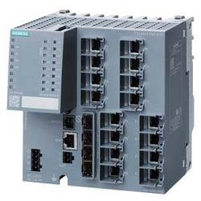

# ASA-1 Produktion Anlage Hardware informationen

## Siemens Edge Device mit Windows

* **SIMATIC IPC127E**
  * Atom E3930 4GB RAM mit TPM
  * 2x Ethernet RJ45
  *  Windows 10 IoT Enterprise 2021 LTSC
  * 128 GB SSD
  
## Siemens Switch Layer 3 
* **SCALANCE XM416-4C**
   * Managed modular IE Switch
  * 16x 10/100/1000 Mbit/s RJ45
  * 4x 100/1000 Mbit/s SFP
  * enthält 4 Combo-Ports
  * in Summe 16 Ports nutzbar
  * erweiterbar auf 24 Ports elektrisch oder optisch
  * Montage: Hut-/S7-Profilschiene
  * PROFINET IO Device
  * Redundanzfunktionen
  * Office Features (RSTP, VLAN, IGMP,..)
  * C-PLUG im Lieferumfang
  * Layer 3 integriert
 