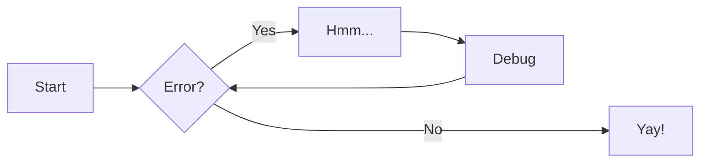

# Diagrams

Diagrams help to communicate complex relationships and interconnections between
different technical components, and are a great addition to project
documentation. Material for MkDocs integrates with [Mermaid.js][1], a very
popular and flexible solution for drawing diagrams.

  [1]: https://mermaid-js.github.io/mermaid/

## Configuration

### SuperFences

[:octicons-file-code-24: Source][2] ·
:octicons-beaker-24: Experimental ·
[:octicons-heart-fill-24:{ .mdx-heart } Insiders only][2]{ .mdx-insiders }

The [SuperFences][3] extension, which is part of [Python Markdown
Extensions][4], allows for adding __custom fences__, which can be used to
render [Mermaid.js][1] diagrams with zero effort:

``` yaml
markdown_extensions:
  - pymdownx.superfences:
      custom_fences:
        - name: mermaid
          class: mermaid-experimental
          format: !!python/name:pymdownx.superfences.fence_code_format
```

No further configuration is necessary. Material for MkDocs will automatically
load and initialize the [Mermaid.js][1] runtime when a page includes a [fenced
`mermaid` block][5]. Furthermore:

- [x] Works with [instant loading][6] without any additional effort
- [x] Diagrams automatically use fonts and colors defined in `mkdocs.yml`[^1]
- [x] Fonts and colors can be customized with [additional stylesheets][7]
- [x] Support for both, light and dark color schemes

_While it's also possible to integrate [Mermaid.js][1] using existing
third-party plugins[^2], the new native integration is recommended as it
ensures interoperability with all Material for MkDocs features._

  [^1]:
    While all [Mermaid.js][1] features should work out-of-the-box, Material for
    MkDocs will currently only adjust the fonts and colors for flow charts,
    class and state diagrams. Support for further diagram types will be added
    gradually.

  [^2]:
    If you don't want to use the native integration, [mkdocs-mermaid2-plugin][8]
    might be a good alternative. However, note that this plugin cannot be used
    in conjunction with the [mkdocs-minify-plugin][9] and doesn't adapt to
    dark mode.

  [2]: ../insiders/index.md
  [3]: https://facelessuser.github.io/pymdown-extensions/extensions/superfences/
  [4]: https://facelessuser.github.io/pymdown-extensions/
  [5]: #usage
  [6]: ../setup/setting-up-navigation.md#instant-loading
  [7]: ../customization.md#additional-css
  [8]: https://github.com/fralau/mkdocs-mermaid2-plugin
  [9]: https://github.com/byrnereese/mkdocs-minify-plugin

## Usage

### Using diagrams

Mermaid diagrams are written as [code blocks][10] with the help of the
[SuperFences][11] extension. They must be enclosed with two separate lines
containing three backticks:

_Example_:

```` markdown

````

_Result_:

[![Diagram][12]{ style="width: 100%; max-width: 594px" }][12]

_See the [official documentation][1] to learn about all available diagram 
types._

  [10]: code-blocks.md
  [11]: #superfences
  [12]: ../assets/screenshots/diagram.png
